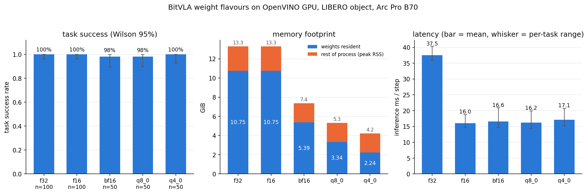

# `vla.cpp` on Intel CPUs, GPUs and NPUs (OpenVINO backend)

Notes for building `vla.cpp` against ggml's OpenVINO backend, and an honest
account of how far it currently runs. Like SYCL, OpenVINO is **not**
auto-detected: it needs an explicit `-DGGML_OPENVINO=ON` and the OpenVINO
runtime on the configure line.

> **Status: every architecture in the tree translates faithfully, on the CPU
> plugin and on the iGPU.** Ten of the eleven - SmolVLA, π0, π0.5, Evo-1,
> VLA-Adapter, GR00T N1.5, GR00T N1.6, GR00T N1.7, VLA-JEPA and OpenVLA-OFT -
> agree with a CPU-backend reference to 1.4e-3 or better on the OpenVINO CPU
> plugin, and nine of the ten are inside the same bar on the Arc B390 iGPU, where
> the speedup over the native CPU backend runs from 3.0x to 9.6x.
>
> The eleventh, **BitVLA**, used to pin its ggml graph to the CPU backend by
> design and never reach this backend at all. It does now, and it is the one
> architecture here that **cannot be scored on action equality** - see
> [BitVLA has no action bar](#bitvla-has-no-action-bar). It is scored on task
> success instead, and on an **Arc Pro B70** it solves **100.0%** of LIBERO-object
> (10 tasks x 10 episodes) at **16.0 ms/step**, against the hand-written SYCL
> ternary kernels' 22.7 ms on the same silicon.
>
> Fifteen fixes were needed, thirteen of them inside ggml's OpenVINO backend, which
> is written against llama.cpp's graphs and had never seen a vision tower or an
> action expert - see [What had to change](#what-had-to-change).
>
> Note the baseline: OpenVINO executes the checkpoint's BF16 weights at F32, so
> compare against `--weight-dtype f32` or you will charge the backend for a
> precision upgrade. See [Picking the right baseline](#picking-the-right-baseline).

Measured on an **Intel Core Ultra X7 358H** (Panther Lake) with the Arc B390
iGPU and the AI Boost NPU, Ubuntu 24.04, OpenVINO 2026.2.1, llama.cpp `b10729`,
on the checkpoints under `vrfai/` on the Hub. Every **fidelity** number was
re-measured on that pin; only the **latency** table still dates from `b10331`.

ggml's backend translates a ggml compute graph into an OpenVINO model and hands
it to the CPU, GPU or NPU plugin, which compiles and fuses it for the device.
Unlike SYCL it needs no separate compiler: the stock GCC/Clang build links
`libopenvino`.

## Supported devices

Intel CPUs, Intel GPUs (integrated Xe / Arc, and discrete), and Intel NPUs
(Core Ultra). Linux only here - Ubuntu 22.04 or 24.04.

## Prerequisites

### 1. Device access

The CPU plugin needs nothing. The GPU and NPU plugins reach the hardware through
`/dev/dri/renderD*` and `/dev/accel/accel0`, both owned by the `render` group:

```bash
sudo usermod -aG render,video "$USER"   # re-login afterwards
clinfo -l                               # must enumerate the GPU
```

`Number of platforms 0` with `/etc/OpenCL/vendors/intel.icd` present almost
always means the render group has not taken effect yet. Without it,
`GGML_OPENVINO_DEVICE=GPU` warns and silently falls back to the CPU plugin.

For the GPU compute runtime and NPU driver packages themselves, follow
[llama.cpp's OpenVINO notes](https://github.com/ggml-org/llama.cpp/blob/master/docs/backend/OPENVINO.md).

The NPU needs two more things its driver packages do not pull in. Neither failure
is reported as an error - the device simply does not appear and every
`GGML_OPENVINO_DEVICE=NPU` run lands on the CPU plugin instead
(`device NPU is not available, fallback to CPU`).

```bash
sudo apt-get install -y libze1   # the Level Zero loader; the driver alone is not enough
                                 # check with: ldconfig -p | grep ze_loader
export ZE_ENABLE_ALT_DRIVERS=/lib/x86_64-linux-gnu/libze_intel_npu.so.1
```

Ubuntu's loader (1.16.1 in noble) does not discover `libze_intel_npu.so.1` on its
own, hence the override; a loader from Intel's own graphics repository,
version-matched to the driver, should not need it - untested here. With both in
place the device enumerates as `NPU  Intel(R) AI Boost`.

### 2. OpenVINO runtime + OpenCL headers

```bash
sudo apt-get install -y opencl-clhpp-headers ocl-icd-opencl-dev opencl-headers \
    cmake ninja-build pkg-config protobuf-compiler libprotobuf-dev \
    libzmq3-dev cppzmq-dev
```

Then either install OpenVINO
[from the archive](https://docs.openvino.ai/2026/get-started/install-openvino/install-openvino-archive-linux.html)
by hand, or run `bash scripts/install_ov.sh`, which also pulls the GPU driver
stack and adds you to `render`.

## Configure & build

```bash
source /opt/intel/openvino/setupvars.sh

cmake -B build-ov -G Ninja -DCMAKE_BUILD_TYPE=Release -DGGML_OPENVINO=ON
cmake --build build-ov -j$(nproc)
```

`setupvars.sh` must be sourced in every shell that builds *or* runs the binaries:
`libopenvino.so` and its TBB live under `/opt/intel`. Configure fails early with
a pointer back here if the runtime is not on `CMAKE_PREFIX_PATH`.

`scripts/patch_ggml_openvino.py` runs as the FetchContent patch step, so the
thirteen ggml fixes are applied automatically - there is no manual `git apply`.
The step only runs when FetchContent populates the source dir, so a `build/_deps`
left over from an older checkout keeps the hunks it was patched with: delete it
after pulling rather than trusting a reconfigure. The script checks each hunk on
its own and fails loudly on a tree it cannot bring up to date.

## Run

`GGML_OPENVINO_DEVICE` picks the target by name (`VLA_DEVICE` does *not* apply -
ggml exposes OpenVINO as a single device):

```bash
GGML_OPENVINO_DEVICE=GPU ./build-ov/vla-server ./weights/smolvla-libero.gguf
```

Two lines identify the selection at startup:

```text
OpenVINO: using device GPU
vla: backend = OPENVINO (asked for GPU, see ggml's "using device" line)
```

The first comes from ggml and is authoritative: an unavailable device logs a
warning there and falls back to `CPU`, which is still the OpenVINO CPU plugin,
not ggml's native CPU backend. The second echoes what was requested, so the pair
tells you whether you got the device you asked for.

OpenVINO compiles each graph on first use, which is slow - a minute or two for a
vision tower on the GPU. Compiled graphs are then cached in-process for the life
of the model, so only the first prediction pays that; give any client a receive
timeout well above the first request. Do **not** set `GGML_OPENVINO_CACHE_DIR` to
carry them across restarts; it produces silently wrong actions here - see
[Known issues](#known-issues).

## Results

`vla_predict_check` (a test target - add `-DVLA_BUILD_TESTS=ON`), fixed noise,
one camera view, best of 4-6 iterations after 3 warmups. "CPU backend" is ggml's
own CPU backend on the same 16-core host. No `GGML_OPENVINO_CACHE_DIR`.

Latencies were taken at `b10331` and have not been re-timed on `b10729`. Read the
GPU column for VLA-JEPA and GR00T N1.7 as the cost of a wrong answer at that pin;
both are correct now.

| Model | input | CPU backend | OpenVINO CPU | OpenVINO GPU | OpenVINO NPU |
|---|---|---:|---:|---:|---:|
| VLA-JEPA    | 256 | 1,046 ms | 1,265 ms | **127 ms** (8.2x) | returns NaN |
| GR00T N1.5  | 224 | 1,420 ms | 2,199 ms | **148 ms** (9.6x) | plugin throws |
| VLA-Adapter | 224 | 1,228 ms | 1,603 ms | **161 ms** (7.6x) | not supported |
| GR00T N1.6  | 224 | 1,276 ms | 2,256 ms | **323 ms** (3.9x) | plugin throws |
| SmolVLA     | 512 | 1,364 ms | 1,340 ms | **451 ms** (3.0x) | 1,162 ms |
| Evo-1       | 448 | 3,114 ms | 4,523 ms | **563 ms** (5.5x) | not supported |
| π0.5        | 224 | 2,802 ms | 4,285 ms | **683 ms** (4.1x) |   916 ms |
| GR00T N1.7  | 256 | 1,146 ms | not timed | **288 ms** (4.0x) | not attempted |

The iGPU is the reason to use this backend, and it pays off most where the model
is most vision-heavy. The OpenVINO CPU plugin is at best parity with ggml's own
CPU backend and often well behind it, so it is only worth running to debug a
translation. The NPU beats the CPU backend on the two models it accepts while
drawing far less power, which is the interesting result for a robot - see the
NPU limits under [Known issues](#known-issues).

### Picking the right baseline

Actions are checked against the CPU backend on identical inputs; both sides are
deterministic, so the numbers are exact rather than sampled. But **which** CPU run
you compare against matters. OpenVINO folds the checkpoint's BF16 weights in as
constants and its CPU plugin executes them at F32, while ggml's CPU backend keeps
them BF16, so a naive comparison charges the OpenVINO backend for a precision
*upgrade*. Running the reference with `--weight-dtype f32` removes that term.

The two references bracket the answer, and which is tighter turns on how much of
a given checkpoint is BF16 in the first place. Report both and take the smaller:

| Model | vs BF16 reference | vs F32 reference | tighter reference |
|---|---:|---:|---|
| VLA-Adapter | 2.1e-3 | **2.4e-6** | F32 |
| Evo-1       | 2.7e-3 | **3.5e-6** | F32 |
| π0.5        | 7.7e-4 | **3.5e-5** | F32 |
| VLA-JEPA    | 1.1e-2 | **1.1e-4** | F32 |
| GR00T N1.5  | 5.5e-3 | **6.0e-4** | F32 |
| GR00T N1.6  | 5.0e-3 | **1.0e-3** | F32 |
| SmolVLA     | **8.9e-4** | 1.3e-3 | BF16 |
| GR00T N1.7  | 1.5e0 | **4.2e-4** | F32 |

Evo-1 and VLA-Adapter agree with an F32 reference to six decimal places, which is
as close to "the translation is exact" as this harness can show; the BF16
comparison for those two was measuring nothing but the dtype. SmolVLA is the
counterexample that stops this being a universal rule. For context, the CPU
backend's own output moves by 2.0e-3 (SmolVLA), 2.7e-3 (Evo-1) or 1.1e-2
(VLA-JEPA) when you flip that one flag, so the model's intrinsic sensitivity to
precision is the same size as the numbers being reported.

### Full results

Against the F32 reference, which is the fidelity number:

| Model | OpenVINO CPU | OpenVINO GPU | OpenVINO NPU |
|---|---:|---:|---:|
| Evo-1       | 2.2e-6 | 6.0e-4 | compiler rejects |
| VLA-Adapter | 3.9e-6 | 6.8e-3 | compiler rejects |
| OpenVLA-OFT | 3.9e-6 | 2.2e-3 | compiler rejects |
| π0.5        | 6.1e-5 | 7.6e-4 | 1.6e-3 |
| VLA-JEPA    | 7.7e-5 | 2.6e-3 | returns NaN |
| GR00T N1.7  | 3.9e-4 | 2.6e-3 | NPUW throws |
| π0          | 5.8e-4 | 6.6e-5 | **1.7e0** |
| GR00T N1.5  | 6.0e-4 | 4.6e-3 | NPUW throws |
| GR00T N1.6  | 1.1e-3 | 1.4e-3 | NPUW throws |
| SmolVLA     | 1.4e-3 | 2.6e-3 | 1.1e-2 |

Every tested arch is inside the 2.9e-3 bar on the CPU plugin, most by one to
three orders of magnitude, and nine of the ten are inside it on the GPU as well
(GR00T N1.5's 4.6e-3 against F32 is 1.6e-3 against BF16, the tighter reference for
that arch). The one outside is **VLA-Adapter**, at 6.8e-3 against F32 on actions
peaking at 0.62 - the GPU plugin computing in F16, a precision effect rather than
a translation error, since the same arch is 3.9e-6 on the CPU plugin. Judge
translation fidelity on the CPU plugin and treat the GPU as a separate precision
target. π0 is the exception in the other direction, *tighter* on the GPU (6.6e-5)
because it is the one arch that runs the GPU at F32; see
[Known issues](#known-issues), which also covers the NPU column.

### BitVLA has no action bar

Every other architecture on this page is scored by comparing action vectors
against a CPU-backend reference on identical inputs. On BitVLA that comparison
is meaningless, and it is worth saying why, because the obvious reading of its
numbers - "the port is 20x worse than everything else" - is wrong.

BitVLA's BitNet activation quantiser rounds to the nearest integer and clamps,
roughly **200 times per forward pass**. A hard threshold is not a smoothing
operation: a value that lands on the wrong side of a `.5` boundary changes an
integer, not a low-order bit, and nothing downstream averages that back out.

Perturbing the LM's input embeddings by a single f32 ULP and measuring the
resulting action chunk (ggml-CPU on both sides, no OpenVINO anywhere in the
measurement - `ci/slurm/bmg_bitvla_sensitivity.sbatch`):

| eps | 1.2e-07 | 1e-06 | 1e-05 | 1e-04 | 1e-03 | 6.3e-03 |
|---|---:|---:|---:|---:|---:|---:|
| normalised action deviation | 0.0682 | 0.0675 | 0.0747 | 0.0837 | 0.1361 | 0.1427 |

The curve is **flat** all the way down to one ULP. BitVLA therefore has a
decorrelation floor around **0.068** - 23x the 2.9e-3 bar the other ten
architectures are held to - and *no* implementation that is not bit-identical to
ggml-CPU can get under it, including a perfectly correct one. Confirming this,
the OpenVINO LM on byte-identical inputs scores 0.0702, sitting exactly on the
floor. Above the floor the numbers are draws from a decorrelated distribution
and do not even rank configurations: the GPU plugin at F32 scored 0.1092 against
the CPU plugin's 0.1336, which means nothing at all.

So BitVLA is gated on **task success rate** (`ci/slurm/bmg_ov_libero.sbatch`),
and that gate is not a weaker one - it is the only one that can distinguish a
working policy from a broken one here. On the Arc Pro B70 it scores 100.0% over
10 LIBERO-object tasks x 10 episodes at both F16 and F32 (16.0 vs 37.5 ms/step),
which is why BitVLA is *not* in the `GGML_OPENVINO_GPU_PRECISION=f32` default
list in `src/backend.h` even though its quantiser looks like exactly the kind of
thing that would need to be.

If you are porting another architecture with a hard threshold in its forward
pass, measure this curve before trusting an action-equality gate on it.

### BitVLA weight flavours

BitVLA's weights carry 1.58 bits each, and until recently the OpenVINO path kept
them dense at F32 - 10.77 GiB for a 1.44 GiB checkpoint. Three flavours are now
reachable, all produced from the published int2 GGUF by
`scripts/transcode_bitvla_int2.py --weight-dtype`, and all measured on the Arc
Pro B70, 10 LIBERO-object tasks x 5 episodes, GPU plugin at F16 (job 372759):

| flavour | resident | bytes/weight | task success | ms/step |
|---|---:|---:|---:|---:|
| F32 (the old default) | 10.77 GiB | 4.00 | - | 37.5 |
| bf16 | 5.39 GiB | 2.00 | 49/50 = 98.0% | 16.6 |
| q8_0 | 3.34 GiB | 1.06 | 49/50 = 98.0% | 16.2 |
| q4_0 | **2.24 GiB** | 0.64 | **50/50 = 100.0%** | 17.1 |



The figure separates two wins that are easy to conflate. Latency is entirely the
`f32 -> f16` step, a compute-precision change; footprint is entirely the
`f16 -> q4_0` step, a weight-format change, across which latency is flat.
Neither buys the other. The memory panel is stacked because peak process RSS
*contains* the weights: what sits above them is a constant ~2 GiB that no weight
format touches. All five success intervals overlap, so the honest reading is
that this sweep did not resolve a success difference between the arms - not that
q4_0 is better than bf16. Redraw it with `ci/slurm/plot_ov_quant.sbatch`.

The three arms are within one episode of each other, and the single miss in the
bf16 and q8_0 arms is the *same* task in both - task difficulty, not a precision
effect. That is the expected result rather than a lucky one: on ternary weights
times a per-tensor scale the block formats are **more** faithful than bf16, which
spends its mantissa re-representing a scale a block format stores once per 32
weights (max relative error: bf16 1.34e-03, q8_0 5.89e-05, q4_0 1.78e-04 -
pinned by `ci/test_bitvla_quant.py`).

Two things to know before generating these files yourself:

- **ggml's stock Q4_0 quantiser is unusable on ternary weights** and the reason
  is structural. Q4_0 dequantises as `d*(q-8)` with `q` in `[0,15]`; ggml picks
  `d = max/-8`, which reaches `+s` at `q=0` but would need `q=16` for `-s`, so
  one sign clips to `-7s/8` - 12.5% weight error. `scripts/bitvla_quant.py`
  instead picks `d = s/7`, putting `{-s, 0, +s}` on `q = {1, 8, 15}` exactly.
  `ci/test_bitvla_quant.py` pins the 0.125 as a known-bad value so that anyone
  who later "simplifies" this into a call to `quants.quantize` fails a test.
- **`vit.blk.N.fc2.weight` cannot be block-quantised.** It is `(4304, 1152)` and
  `4304 % 32 == 16`, so all 26 of them stay bf16. That is the whole gap between
  q4_0's ideal 0.5625 bytes/weight and the 0.64 measured.

Only the BitLinear weights are quantised. `token_embd`, the projector, the patch
embedding and the action head are genuinely full-precision weights rather than
ternary ones, and stay bf16 - which also keeps quantised constants away from
`GET_ROWS`.

**Latency does not move**: 16.2-17.1 ms/step across a 2.4x range of resident
size. For context the hand-written SYCL ternary kernels run the same workload at
22.7 ms/step and CUDA on an H100 at 23.4 ms.

#### Why the latency is flat

Two mechanisms produce an identical flat curve and they have opposite
consequences, so this was measured rather than argued
(`ci/slurm/bmg_ov_quant_why_flat.sbatch`, job 372827). Either the workload is
compute-bound and shrinking weights genuinely cannot help, or the plugin expanded
the u4/i8 constants back to f16 at compile time and every arm ran the same dense
GEMM. Both shrink host RSS, because that is the ggml-side buffer either way; they
differ only on the device, and device memory had never been read on this platform
- `eval/client/benchmark.py` samples VRAM through `nvidia-smi`, so every
`*.mem.json` here carries `peak_vram_mib: null`. `scripts/xpu_mem_sample.py`
reads it from per-process DRM fdinfo instead:

| arm | host weights | device VRAM | device GTT | ms/step |
|---|---:|---:|---:|---:|
| bf16 | 5.39 GiB | **4.99 GiB** | 4.77 GiB | 53.5 |
| q8_0 | 3.34 GiB | **2.93 GiB** | 2.51 GiB | 55.3 |
| q4_0 | 2.24 GiB | **1.85 GiB** | 1.32 GiB | 57.0 |

Device memory tracks the weight format at a 2.69x spread, so
`ConvertFullyConnectedToFullyConnectedCompressed` does fire and the weights are
executed compressed. The flat curve is therefore the workload's own property:
weight-only quantisation is a *decode* optimisation, and a VLA step is not a
decode. It is prefill-shaped - a ViT over 256 patches and a prefill over hundreds
of tokens, then an 8x7 action chunk - so at M ~ 300 rows each weight byte is
amortised over ~300 MACs and the GEMMs are FLOP-limited, not bandwidth-limited.
The `f32 -> f16` arm is the same finding from the other side: 37.5 -> 16.0 ms/step
with the weights byte-identical (10.75 GiB resident in both), i.e. 2.3x for a pure
compute-precision change.

The latency column above carries the second confirmation. It rises monotonically
with compression, +6.6% from bf16 to q4_0 - the cost of unpacking nibbles in the
GEMM inner loop, which is free on a bandwidth-bound kernel because it hides behind
memory stalls and is not free here because there are none to hide in. (Those
absolute numbers are ~3x the sweep's because `predict_check` does a full forward
per iteration with no KV reuse; only the across-arm comparison is meaningful, and
it reproduces the flat curve on a second harness.)

So native `element::u2` would buy another 1.6x on footprint and nothing on speed,
and q4_0 is the right floor for this workload.

## What had to change

Fifteen fixes: two in vla.cpp, thirteen in ggml's OpenVINO backend. Both
vla.cpp-side ones are ordinary correctness fixes that happen to be invisible on
the other backends - `vla_predict_check` on a CPU build of this branch is
byte-identical to the same build of the base commit, for every model tested.

- **Weight buffers are tagged.** `ggml_backend_alloc_ctx_tensors` leaves a buffer
  on `GGML_BACKEND_BUFFER_USAGE_ANY`, and ggml-openvino reads ANY as "KV cache",
  giving every weight a dynamic sequence dimension. `vla::alloc_weights` in
  [`src/backend.h`](../../src/backend.h) tags it `..._WEIGHTS`, which is what
  lets the frontend fold weights in as constants. Since 0.3.0 every arch
  allocates through `vla::WeightLoader`, so this is one call site in
  [`src/loader.cpp`](../../src/loader.cpp).
- **Graph tensors get unique names.** ggml derives a result's name from its
  source, so a graph whose intermediates were never named ends up with many
  tensors sharing one name (`" (reshaped)"` and friends). ggml-openvino keys its
  translation map on those names, so duplicates silently collapse into one node
  and the graph wires the wrong tensor into the next op. `vla::graph_unique_names`
  relabels duplicates before compute, at each of the 29
  `ggml_backend_graph_compute` call sites. It compiles to nothing outside an
  OpenVINO build.

`backend_init` also sets one default, the way the SYCL rung already sets
`GGML_SYCL_ENABLE_VMM=0`: **`GGML_OPENVINO_NAIVE_GRAPH_SIZE` defaults high.**
ggml-openvino translates a graph under 20 nodes literally and sends anything
larger through a model builder that assumes a decoder-only LLM. The literal path
is the one that fits a vision tower and an action expert. An explicit setting
still wins.

The other thirteen are applied to ggml's OpenVINO backend by
`scripts/patch_ggml_openvino.py` at configure time; its docstring carries the
per-fix detail. Each narrows an llama.cpp-shaped assumption that is stricter than
the ggml contract, or fills a gap:

| Fix | What it addresses |
|---|---|
| **PERMUTE op_case 2 requires a ROPE** | **assumes any permute of a view is a rope'd query** |
| **Two elementwise adds never stacked on a GEMM** | **the GPU plugin folds both in as post-ops and drops the second operand** |
| GPU inference precision exposed | the plugin's F16 default compounds through a denoise loop unrolled in one graph |
| **GELU translated as tanh, not erf** | **assumes ggml's GELU is the exact erf form** |
| Intel OpenCL platform selection | assumes the first OpenCL platform is Intel's |
| RESHAPE `op_case` guard | assumes a reshape flattening dims 0-2 is the KV-cache flatten |
| SDPA K/V converted with Q | assumes K/V arrive as F16 because the KV cache is |
| **Position inputs keyed per tensor** | **assumes a graph has exactly one position input** |
| Folded weights padded to full rank | a 2-D weight becomes a rank-2 constant, but views index it at ggml rank |
| CONCAT input ranks aligned | same rank-2 constants, and concat cannot broadcast rank |
| Missing `GELU_ERF` translator | the exact-erf GELU op had no table entry at all, so a graph using it could not run |
| Naive-path graph cache | that path re-compiled the whole model on every graph_compute, and its `graph_key` is a node count plus two names, which two graphs can share |
| Interleaved-mrope sectors bounded | the sector cycle ignored `sections`, so the last few took the wrong stream |
| Naive-path threshold settable | the 20-node constant is what picks the literal path |

The bolded rows are the ones that turned a wrong arch into a correct one:
PERMUTE op_case 2 for GR00T N1.7, the double-elementwise guard for the Eagle-VLM
archs on the iGPU, the GELU mode for VLA-JEPA and GR00T N1.5, per-tensor position
inputs for SmolVLA (which passes three position tensors, so they aliased). The
GELU mode and the position-input fix are the two worth upstreaming.

**Debugging a mistranslation.** The backend writes back true graph outputs and
nothing else, so an interior tensor is observable only two ways: truncate the
graph at a stage, which makes that stage the terminal node, or set
`GGML_OPENVINO_DEBUG_NODE` to materialise one node as an extra `ov::Result`. Both
of the subtlest fixes above were found by bisecting that way, comparing each
stage against a CPU-backend reference; neither logs anything when it goes wrong.

## Known issues

**π0 needs F32 on the GPU, and gets it by default.** The GPU plugin computes in
F16, which is most of why it is fast. π0 unrolls its whole 10-step denoise loop
inside a single graph, so that error compounds with nothing to reset it: its
continuous action dims land 4e-2 from an F32 reference and its gripper - a
saturating ±1 channel - crosses its threshold one step late. That reads as
max|delta| 1.7; on a robot it is a late grasp. `GGML_OPENVINO_GPU_PRECISION=f32`
puts it back at 6.5e-5, and `backend_init` defaults it for π0 alone because it
costs about 3x (383 ms -> 1,170 ms). Set `=f16` to override. No other arch needs
it.

**Do not set `GGML_OPENVINO_CACHE_DIR`.** OpenVINO's on-disk blob cache reloads a
compiled graph that computes the wrong thing. A cold run against a fresh cache
directory is correct; the very next run, reading back the blobs it just wrote, is
not - max|delta| 1.2e-3 cold, 2.9e0 warm, with nothing logged, which for a policy
server is the worst possible failure mode. `backend_init` therefore clears the
variable and says so; `VLA_ALLOW_OV_CACHE=1` keeps it. Unverified guess at the
cause: the blob key does not capture something that differs between vla.cpp's
several graphs, so one graph gets another's blob - the same class of bug as the
in-process `graph_key` above, which is now keyed on shapes. In practice, pay the
compile once per process and leave it unset.

**The NPU accepts three of the ten archs, and only two of those are correct.**
Check every NPU run against the startup banner: an unavailable NPU falls back to
the CPU plugin silently and would otherwise report excellent numbers that are not
NPU numbers at all. A partially-failing run still reports a wall-clock time, so
do not read a latency off a run whose actions did not come out.

| Model | NPU outcome |
|---|---|
| SmolVLA | runs, 1.1e-2 (the compile config's dynamic quantization) |
| π0.5 | runs, 1.6e-3 |
| π0 | runs, but **1.7e0 wrong** - see below |
| VLA-JEPA | compiles and runs, returns all `NaN` (not diagnosed) |
| GR00T N1.5 / N1.6 / N1.7 | `NPUW: Assertion all_ok failed`, `partitioning.cpp:1350` |
| Evo-1 | compiler rejects: `Input channels '1025' is not aligned by '16'` |
| VLA-Adapter | compiler rejects: `Input channels '261' is not aligned by '16'` |
| OpenVLA-OFT | compiler rejects: `Input channels '261' is not aligned by '16'` |

The three alignment rejections are Intel's NPU compiler: 1025 is Evo-1's 1024
patches plus a CLS token, and 261 is 256 plus 5 - VLA-Adapter and OpenVLA-OFT hit
the identical number for the identical reason. SmolVLA and π0.5 happen to have
16-aligned sequence lengths. None of these are vla.cpp's doing.

**π0 on the NPU is the same bug as π0 on the GPU, and here there is no remedy.**
Continuous dims 0-5 land at 4.0e-2 and the gripper flips at step 44, exactly as
on the GPU. But the GPU fix does not transfer: setting the inference precision to
F32 makes the NPU refuse to compile at all (`core.cpp:117`), because the hint
conflicts with the NPUW and dynamic-quantization config the NPU path sets up. So
`GGML_OPENVINO_GPU_PRECISION` is GPU-only by necessity, and π0 should not be run
on the NPU.

**SmolVLA's `VLA_TIMING=phase` path is wrong under OpenVINO.** SmolVLA has a
second graph builder used when a caller asks for per-phase timings, and it does
not survive translation - max|delta| 1.9 on every device. The default
`TimingDetail::NONE` path, which is what `vla-server` and `vla-cli` use, is
correct, and on the native CPU backend the two paths agree exactly. Evo-1 and
π0.5 are unaffected on the same path, so this is specific to SmolVLA's second
graph; one hypothesis - that the split-graph guard sends it down the LLM path -
was tested and is wrong. Per-stage timings for SmolVLA are omitted from the
tables above.

## TODO

**Fixing issue channel not aligned by 16.** Feasible solution is padding dummy
channel so that number of channels is a multiple of 16.

**Splitting across devices.** Intel's own
[π0.5 write-up](https://docs.openedgeplatform.intel.com/2026.1/OEP-articles/publications/optimizing-pi0.5-lva-model.html)
puts the vision encoder and language model on the iGPU and the action expert on
the NPU, with the KV cache as the only cross-device handoff. The toolchain does
not carry over - PyTorch exported to OpenVINO IR as three separate models, no
ggml - but the shape of the answer does: the two devices suit different stages,
and π0.5 on the NPU alone is already within 1.5x of the iGPU at a fraction of the
power. vla.cpp cannot make that split today because the core drives one backend
for a whole prediction. It would need a per-*stage* backend rather than a per-op
scheduler - the vision tower, the prefix and the action expert already hand off
through host memory, so the seam is in the right place - but that is an engine
change, not a backend one.
