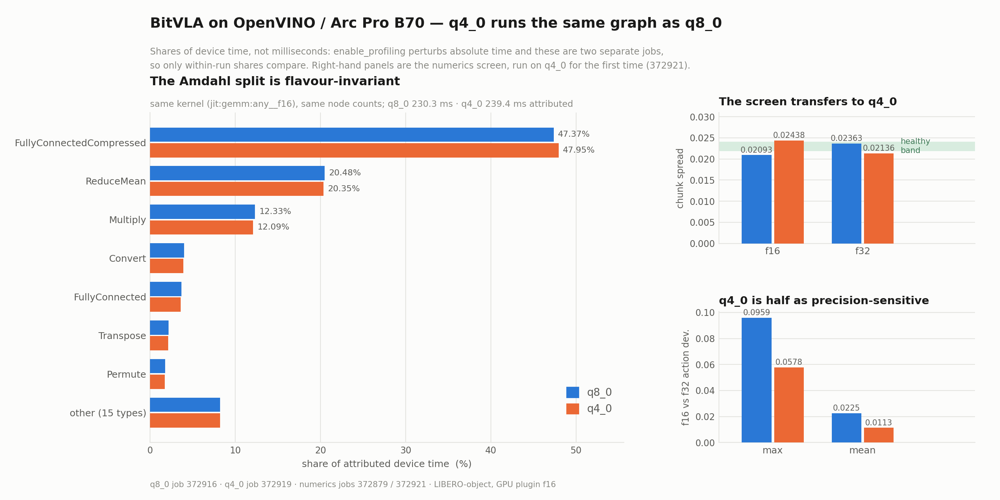

# `vla.cpp` on Intel CPUs, GPUs and NPUs (OpenVINO backend)

Notes for building `vla.cpp` against ggml's OpenVINO backend, and an honest
account of how far it currently runs. Like SYCL, OpenVINO is **not**
auto-detected: it needs an explicit `-DGGML_OPENVINO=ON` and the OpenVINO
runtime on the configure line.

> **Status: every architecture in the tree translates faithfully, on the CPU
> plugin and on the iGPU.** Ten of the eleven - SmolVLA, π0, π0.5, Evo-1,
> VLA-Adapter, GR00T N1.5, GR00T N1.6, GR00T N1.7, VLA-JEPA and OpenVLA-OFT -
> agree with a CPU-backend reference to 1.4e-3 or better on the OpenVINO CPU
> plugin, and nine of the ten are inside the same bar on the Arc B390 iGPU, where
> the speedup over the native CPU backend runs from 3.0x to 9.6x.
>
> The eleventh, **BitVLA**, used to pin its ggml graph to the CPU backend by
> design and never reach this backend at all. It does now, and it is the one
> architecture here that **cannot be scored on action equality** - see
> [BitVLA has no action bar](#bitvla-has-no-action-bar). It is scored on task
> success instead, and on an **Arc Pro B70** it solves **100.0%** of LIBERO-object
> (10 tasks x 10 episodes) at **16.0 ms/step**, against the hand-written SYCL
> ternary kernels' 22.7 ms on the same silicon.
>
> Fifteen fixes were needed, thirteen of them inside ggml's OpenVINO backend, which
> is written against llama.cpp's graphs and had never seen a vision tower or an
> action expert - see [What had to change](#what-had-to-change).
>
> Note the baseline: OpenVINO executes the checkpoint's BF16 weights at F32, so
> compare against `--weight-dtype f32` or you will charge the backend for a
> precision upgrade. See [Picking the right baseline](#picking-the-right-baseline).

Measured on an **Intel Core Ultra X7 358H** (Panther Lake) with the Arc B390
iGPU and the AI Boost NPU, Ubuntu 24.04, OpenVINO 2026.2.1, llama.cpp `b10729`,
on the checkpoints under `vrfai/` on the Hub. Every **fidelity** number was
re-measured on that pin; only the **latency** table still dates from `b10331`.

ggml's backend translates a ggml compute graph into an OpenVINO model and hands
it to the CPU, GPU or NPU plugin, which compiles and fuses it for the device.
Unlike SYCL it needs no separate compiler: the stock GCC/Clang build links
`libopenvino`.

## Supported devices

Intel CPUs, Intel GPUs (integrated Xe / Arc, and discrete), and Intel NPUs
(Core Ultra). Linux only here - Ubuntu 22.04 or 24.04.

## Prerequisites

### 1. Device access

The CPU plugin needs nothing. The GPU and NPU plugins reach the hardware through
`/dev/dri/renderD*` and `/dev/accel/accel0`, both owned by the `render` group:

```bash
sudo usermod -aG render,video "$USER"   # re-login afterwards
clinfo -l                               # must enumerate the GPU
```

`Number of platforms 0` with `/etc/OpenCL/vendors/intel.icd` present almost
always means the render group has not taken effect yet. Without it,
`GGML_OPENVINO_DEVICE=GPU` warns and silently falls back to the CPU plugin.

For the GPU compute runtime and NPU driver packages themselves, follow
[llama.cpp's OpenVINO notes](https://github.com/ggml-org/llama.cpp/blob/master/docs/backend/OPENVINO.md).

The NPU needs two more things its driver packages do not pull in. Neither failure
is reported as an error - the device simply does not appear and every
`GGML_OPENVINO_DEVICE=NPU` run lands on the CPU plugin instead
(`device NPU is not available, fallback to CPU`).

```bash
sudo apt-get install -y libze1   # the Level Zero loader; the driver alone is not enough
                                 # check with: ldconfig -p | grep ze_loader
export ZE_ENABLE_ALT_DRIVERS=/lib/x86_64-linux-gnu/libze_intel_npu.so.1
```

Ubuntu's loader (1.16.1 in noble) does not discover `libze_intel_npu.so.1` on its
own, hence the override; a loader from Intel's own graphics repository,
version-matched to the driver, should not need it - untested here. With both in
place the device enumerates as `NPU  Intel(R) AI Boost`.

### 2. OpenVINO runtime + OpenCL headers

```bash
sudo apt-get install -y opencl-clhpp-headers ocl-icd-opencl-dev opencl-headers \
    cmake ninja-build pkg-config protobuf-compiler libprotobuf-dev \
    libzmq3-dev cppzmq-dev
```

Then either install OpenVINO
[from the archive](https://docs.openvino.ai/2026/get-started/install-openvino/install-openvino-archive-linux.html)
by hand, or run `bash scripts/install_ov.sh`, which also pulls the GPU driver
stack and adds you to `render`.

## Configure & build

```bash
source /opt/intel/openvino/setupvars.sh

cmake -B build-ov -G Ninja -DCMAKE_BUILD_TYPE=Release -DGGML_OPENVINO=ON
cmake --build build-ov -j$(nproc)
```

`setupvars.sh` must be sourced in every shell that builds *or* runs the binaries:
`libopenvino.so` and its TBB live under `/opt/intel`. Configure fails early with
a pointer back here if the runtime is not on `CMAKE_PREFIX_PATH`.

`scripts/patch_ggml_openvino.py` runs as the FetchContent patch step, so the
thirteen ggml fixes are applied automatically - there is no manual `git apply`.
The step only runs when FetchContent populates the source dir, so a `build/_deps`
left over from an older checkout keeps the hunks it was patched with: delete it
after pulling rather than trusting a reconfigure. The script checks each hunk on
its own and fails loudly on a tree it cannot bring up to date.

## Run

`GGML_OPENVINO_DEVICE` picks the target by name (`VLA_DEVICE` does *not* apply -
ggml exposes OpenVINO as a single device):

```bash
GGML_OPENVINO_DEVICE=GPU ./build-ov/vla-server ./weights/smolvla-libero.gguf
```

Two lines identify the selection at startup:

```text
OpenVINO: using device GPU
vla: backend = OPENVINO (asked for GPU, see ggml's "using device" line)
```

The first comes from ggml and is authoritative: an unavailable device logs a
warning there and falls back to `CPU`, which is still the OpenVINO CPU plugin,
not ggml's native CPU backend. The second echoes what was requested, so the pair
tells you whether you got the device you asked for.

OpenVINO compiles each graph on first use, which is slow - a minute or two for a
vision tower on the GPU. Compiled graphs are then cached in-process for the life
of the model, so only the first prediction pays that; give any client a receive
timeout well above the first request. Do **not** set `GGML_OPENVINO_CACHE_DIR` to
carry them across restarts; it produces silently wrong actions here - see
[Known issues](#known-issues).

## Results

`vla_predict_check` (a test target - add `-DVLA_BUILD_TESTS=ON`), fixed noise,
one camera view, best of 4-6 iterations after 3 warmups. "CPU backend" is ggml's
own CPU backend on the same 16-core host. No `GGML_OPENVINO_CACHE_DIR`.

Latencies were taken at `b10331` and have not been re-timed on `b10729`. Read the
GPU column for VLA-JEPA and GR00T N1.7 as the cost of a wrong answer at that pin;
both are correct now.

| Model | input | CPU backend | OpenVINO CPU | OpenVINO GPU | OpenVINO NPU |
|---|---|---:|---:|---:|---:|
| VLA-JEPA    | 256 | 1,046 ms | 1,265 ms | **127 ms** (8.2x) | returns NaN |
| GR00T N1.5  | 224 | 1,420 ms | 2,199 ms | **148 ms** (9.6x) | plugin throws |
| VLA-Adapter | 224 | 1,228 ms | 1,603 ms | **161 ms** (7.6x) | not supported |
| GR00T N1.6  | 224 | 1,276 ms | 2,256 ms | **323 ms** (3.9x) | plugin throws |
| SmolVLA     | 512 | 1,364 ms | 1,340 ms | **451 ms** (3.0x) | 1,162 ms |
| Evo-1       | 448 | 3,114 ms | 4,523 ms | **563 ms** (5.5x) | not supported |
| π0.5        | 224 | 2,802 ms | 4,285 ms | **683 ms** (4.1x) |   916 ms |
| GR00T N1.7  | 256 | 1,146 ms | not timed | **288 ms** (4.0x) | not attempted |

The iGPU is the reason to use this backend, and it pays off most where the model
is most vision-heavy. The OpenVINO CPU plugin is at best parity with ggml's own
CPU backend and often well behind it, so it is only worth running to debug a
translation. The NPU beats the CPU backend on the two models it accepts while
drawing far less power, which is the interesting result for a robot - see the
NPU limits under [Known issues](#known-issues).

### Picking the right baseline

Actions are checked against the CPU backend on identical inputs; both sides are
deterministic, so the numbers are exact rather than sampled. But **which** CPU run
you compare against matters. OpenVINO folds the checkpoint's BF16 weights in as
constants and its CPU plugin executes them at F32, while ggml's CPU backend keeps
them BF16, so a naive comparison charges the OpenVINO backend for a precision
*upgrade*. Running the reference with `--weight-dtype f32` removes that term.

The two references bracket the answer, and which is tighter turns on how much of
a given checkpoint is BF16 in the first place. Report both and take the smaller:

| Model | vs BF16 reference | vs F32 reference | tighter reference |
|---|---:|---:|---|
| VLA-Adapter | 2.1e-3 | **2.4e-6** | F32 |
| Evo-1       | 2.7e-3 | **3.5e-6** | F32 |
| π0.5        | 7.7e-4 | **3.5e-5** | F32 |
| VLA-JEPA    | 1.1e-2 | **1.1e-4** | F32 |
| GR00T N1.5  | 5.5e-3 | **6.0e-4** | F32 |
| GR00T N1.6  | 5.0e-3 | **1.0e-3** | F32 |
| SmolVLA     | **8.9e-4** | 1.3e-3 | BF16 |
| GR00T N1.7  | 1.5e0 | **4.2e-4** | F32 |

Evo-1 and VLA-Adapter agree with an F32 reference to six decimal places, which is
as close to "the translation is exact" as this harness can show; the BF16
comparison for those two was measuring nothing but the dtype. SmolVLA is the
counterexample that stops this being a universal rule. For context, the CPU
backend's own output moves by 2.0e-3 (SmolVLA), 2.7e-3 (Evo-1) or 1.1e-2
(VLA-JEPA) when you flip that one flag, so the model's intrinsic sensitivity to
precision is the same size as the numbers being reported.

### Full results

Against the F32 reference, which is the fidelity number:

| Model | OpenVINO CPU | OpenVINO GPU | OpenVINO NPU |
|---|---:|---:|---:|
| Evo-1       | 2.2e-6 | 6.0e-4 | compiler rejects |
| VLA-Adapter | 3.9e-6 | 6.8e-3 | compiler rejects |
| OpenVLA-OFT | 3.9e-6 | 2.2e-3 | compiler rejects |
| π0.5        | 6.1e-5 | 7.6e-4 | 1.6e-3 |
| VLA-JEPA    | 7.7e-5 | 2.6e-3 | returns NaN |
| GR00T N1.7  | 3.9e-4 | 2.6e-3 | NPUW throws |
| π0          | 5.8e-4 | 6.6e-5 | **1.7e0** |
| GR00T N1.5  | 6.0e-4 | 4.6e-3 | NPUW throws |
| GR00T N1.6  | 1.1e-3 | 1.4e-3 | NPUW throws |
| SmolVLA     | 1.4e-3 | 2.6e-3 | 1.1e-2 |

Every tested arch is inside the 2.9e-3 bar on the CPU plugin, most by one to
three orders of magnitude, and nine of the ten are inside it on the GPU as well
(GR00T N1.5's 4.6e-3 against F32 is 1.6e-3 against BF16, the tighter reference for
that arch). The one outside is **VLA-Adapter**, at 6.8e-3 against F32 on actions
peaking at 0.62 - the GPU plugin computing in F16, a precision effect rather than
a translation error, since the same arch is 3.9e-6 on the CPU plugin. Judge
translation fidelity on the CPU plugin and treat the GPU as a separate precision
target. π0 is the exception in the other direction, *tighter* on the GPU (6.6e-5)
because it is the one arch that runs the GPU at F32; see
[Known issues](#known-issues), which also covers the NPU column.

### BitVLA has no action bar

Every other architecture on this page is scored by comparing action vectors
against a CPU-backend reference on identical inputs. On BitVLA that comparison
is meaningless, and it is worth saying why, because the obvious reading of its
numbers - "the port is 20x worse than everything else" - is wrong.

BitVLA's BitNet activation quantiser rounds to the nearest integer and clamps,
roughly **200 times per forward pass**. A hard threshold is not a smoothing
operation: a value that lands on the wrong side of a `.5` boundary changes an
integer, not a low-order bit, and nothing downstream averages that back out.

Perturbing the LM's input embeddings by a single f32 ULP and measuring the
resulting action chunk (ggml-CPU on both sides, no OpenVINO anywhere in the
measurement - `ci/slurm/bmg_bitvla_sensitivity.sbatch`):

| eps | 1.2e-07 | 1e-06 | 1e-05 | 1e-04 | 1e-03 | 6.3e-03 |
|---|---:|---:|---:|---:|---:|---:|
| normalised action deviation | 0.0682 | 0.0675 | 0.0747 | 0.0837 | 0.1361 | 0.1427 |

The curve is **flat** all the way down to one ULP. BitVLA therefore has a
decorrelation floor around **0.068** - 23x the 2.9e-3 bar the other ten
architectures are held to - and *no* implementation that is not bit-identical to
ggml-CPU can get under it, including a perfectly correct one. Confirming this,
the OpenVINO LM on byte-identical inputs scores 0.0702, sitting exactly on the
floor. Above the floor the numbers are draws from a decorrelated distribution
and do not even rank configurations: the GPU plugin at F32 scored 0.1092 against
the CPU plugin's 0.1336, which means nothing at all.

So BitVLA is gated on **task success rate** (`ci/slurm/bmg_ov_libero.sbatch`),
and that gate is not a weaker one - it is the only one that can distinguish a
working policy from a broken one here. On the Arc Pro B70 it scores 100.0% over
10 LIBERO-object tasks x 10 episodes at both F16 and F32 (16.0 vs 37.5 ms/step),
which is why BitVLA is *not* in the `GGML_OPENVINO_GPU_PRECISION=f32` default
list in `src/backend.h` even though its quantiser looks like exactly the kind of
thing that would need to be.

If you are porting another architecture with a hard threshold in its forward
pass, measure this curve before trusting an action-equality gate on it.

### BitVLA weight flavours

BitVLA's weights carry 1.58 bits each, and until recently the OpenVINO path kept
them dense at F32 - 10.77 GiB for a 1.44 GiB checkpoint. Three flavours are now
reachable, all produced from the published int2 GGUF by
`scripts/transcode_bitvla_int2.py --weight-dtype`, and all measured on the Arc
Pro B70, 10 LIBERO-object tasks x 5 episodes, GPU plugin at F16 (job 372759):

| flavour | resident | bytes/weight | task success | ms/step |
|---|---:|---:|---:|---:|
| F32 (the old default) | 10.77 GiB | 4.00 | - | 37.5 |
| bf16 | 5.39 GiB | 2.00 | 49/50 = 98.0% | 16.6 |
| q8_0 | 3.34 GiB | 1.06 | 49/50 = 98.0% | 16.2 |
| q4_0 | **2.24 GiB** | 0.64 | **50/50 = 100.0%** | 17.1 |


The figure separates two wins that are easy to conflate. Latency is entirely the
`f32 -> f16` step, a compute-precision change; footprint is entirely the
`f16 -> q4_0` step, a weight-format change, across which latency is flat.
Neither buys the other. The memory panel is stacked because peak process RSS
*contains* the weights: what sits above them is a constant ~2 GiB that no weight
format touches. All five success intervals overlap, so the honest reading is
that this sweep did not resolve a success difference between the arms - not that
q4_0 is better than bf16. Redraw it with `ci/slurm/plot_ov_quant.sbatch`.

The three arms are within one episode of each other, and the single miss in the
bf16 and q8_0 arms is the *same* task in both - task difficulty, not a precision
effect. That is the expected result rather than a lucky one: on ternary weights
times a per-tensor scale the block formats are **more** faithful than bf16, which
spends its mantissa re-representing a scale a block format stores once per 32
weights (max relative error: bf16 1.34e-03, q8_0 5.89e-05, q4_0 1.78e-04 -
pinned by `ci/test_bitvla_quant.py`).

Two things to know before generating these files yourself:

- **ggml's stock Q4_0 quantiser is unusable on ternary weights** and the reason
  is structural. Q4_0 dequantises as `d*(q-8)` with `q` in `[0,15]`; ggml picks
  `d = max/-8`, which reaches `+s` at `q=0` but would need `q=16` for `-s`, so
  one sign clips to `-7s/8` - 12.5% weight error. `scripts/bitvla_quant.py`
  instead picks `d = s/7`, putting `{-s, 0, +s}` on `q = {1, 8, 15}` exactly.
  `ci/test_bitvla_quant.py` pins the 0.125 as a known-bad value so that anyone
  who later "simplifies" this into a call to `quants.quantize` fails a test.
- **`vit.blk.N.fc2.weight` cannot be block-quantised.** It is `(4304, 1152)` and
  `4304 % 32 == 16`, so all 26 of them stay bf16. That is the whole gap between
  q4_0's ideal 0.5625 bytes/weight and the 0.64 measured.

Only the BitLinear weights are quantised. `token_embd`, the projector, the patch
embedding and the action head are genuinely full-precision weights rather than
ternary ones, and stay bf16 - which also keeps quantised constants away from
`GET_ROWS`.

**Latency does not move**: 16.2-17.1 ms/step across a 2.4x range of resident
size. For context the hand-written SYCL ternary kernels run the same workload at
22.7 ms/step and CUDA on an H100 at 23.4 ms.

#### Why the latency is flat

Two mechanisms produce an identical flat curve and they have opposite
consequences, so this was measured rather than argued
(`ci/slurm/bmg_ov_quant_why_flat.sbatch`, job 372827). Either the workload is
compute-bound and shrinking weights genuinely cannot help, or the plugin expanded
the u4/i8 constants back to f16 at compile time and every arm ran the same dense
GEMM. Both shrink host RSS, because that is the ggml-side buffer either way; they
differ only on the device, and device memory had never been read on this platform
- `eval/client/benchmark.py` samples VRAM through `nvidia-smi`, so every
`*.mem.json` here carries `peak_vram_mib: null`. `scripts/xpu_mem_sample.py`
reads it from per-process DRM fdinfo instead:

| arm | host weights | device VRAM | device GTT | ms/step |
|---|---:|---:|---:|---:|
| bf16 | 5.39 GiB | **4.99 GiB** | 4.77 GiB | 53.5 |
| q8_0 | 3.34 GiB | **2.93 GiB** | 2.51 GiB | 55.3 |
| q4_0 | 2.24 GiB | **1.85 GiB** | 1.32 GiB | 57.0 |

Device memory tracks the weight format at a 2.69x spread, so
`ConvertFullyConnectedToFullyConnectedCompressed` does fire and the weights are
executed compressed. The flat curve is therefore the workload's own property:
weight-only quantisation is a *decode* optimisation, and a VLA step is not a
decode. It is prefill-shaped - a ViT over 256 patches and a prefill over hundreds
of tokens, then an 8x7 action chunk - so at M ~ 300 rows each weight byte is
amortised over ~300 MACs and the GEMMs are FLOP-limited, not bandwidth-limited.
The `f32 -> f16` arm is the same finding from the other side: 37.5 -> 16.0 ms/step
with the weights byte-identical (10.75 GiB resident in both), i.e. 2.3x for a pure
compute-precision change.

The latency column above carries the second confirmation. It rises monotonically
with compression, +6.6% from bf16 to q4_0 - the cost of unpacking nibbles in the
GEMM inner loop, which is free on a bandwidth-bound kernel because it hides behind
memory stalls and is not free here because there are none to hide in. (Those
absolute numbers are ~3x the sweep's because `predict_check` does a full forward
per iteration with no KV reuse; only the across-arm comparison is meaningful, and
it reproduces the flat curve on a second harness.)

So native `element::u2` would buy another 1.6x on footprint and nothing on speed,
and q4_0 is the right floor for this workload.

### Where the device time actually goes

If the workload is compute-bound, the next question is what the compute is doing.
`GGML_OPENVINO_PROFILE_OPS=1` dumps `ov::InferRequest::get_profiling_info()` -
node identity and device time per primitive - and `scripts/ov_profile_bucket.py`
buckets it. Run it with `ci/slurm/bmg_ov_profile_ops.sbatch`. q8_0, F16, 24 infer
calls, 40986 node records, 234.24 ms attributed (job 372841):

| node type | ms | % | nodes | kernel |
|---|---:|---:|---:|---|
| FullyConnectedCompressed | 110.78 | 47.3 | 2040 | `jit:gemm:any__f16` |
| ReduceMean | 47.43 | 20.3 | 726 | `reduce_ref__f32` |
| Multiply | 28.52 | 12.2 | 4734 | `generic_eltwise_ref` |
| Convert | 9.45 | 4.0 | 3060 | `reorder_data_fast_b1__f32` |
| FullyConnected | 9.37 | 4.0 | 210 | `jit:gemm:any__f16` |
| everything else | 28.7 | 12.2 | | |

**Use profiling info, not kernel names.** An earlier attempt (job 372831) read a
unitrace kernel table, saw every matmul reported as `gemm_kernel`, and concluded
the compressed `FullyConnected` did not exist. It does -
`FullyConnectedCompressed`, `FullyConnected`, `Gemm` and `MatMul` are all
*implemented by* oneDNN's `jit:gemm:any` micro-kernel, which emits one OpenCL
kernel object under one name. A kernel name identifies an implementation, never a
primitive, and the mapping is many-to-one.

The same table withdraws a second claim: `act_quant` is `Abs` + `ReduceMax` +
`Maximum` + `Power` + its share of `Multiply`, which totals **~5-7%**, not the
~32% job 372831 credited it with from shapes and call counts. The independent
SYCL profile's 8.0% agrees.

#### RMSNorm is 20% of device time, in a reference kernel

`ReduceMean` is `openvino/op/rms_norm.cpp` - the frontend hand-rolls RMSNorm as
`Multiply -> ReduceMean -> Sqrt -> Divide -> Multiply`. `ov::pass::RMSFusion`
would collapse that into one RMS primitive, but its pattern is written against
`Power(x, 2)` while the frontend spells the square `Multiply(x, x)`, so it never
matches and the reduction lands on `reduce_ref` - OpenVINO's generic *reference*
reduction, at 42-119 us per node (the two values track the 2560 and 6912 row
widths exactly). The control is in the same run: the ViT's LayerNorm, which
OpenVINO does recognise, runs `mvn_gpu_bfyx_opt` at **3 us** per node while
computing a mean *and* a variance over comparable data.

`GGML_OPENVINO_RMS_FUSION` changes the spelling. It is **off by default**, and
the reason is the most useful negative result in this file:

| mode | route | job | outcome |
|---|---|---|---|
| 1 `on` | `Power(x,2)` so RMSFusion matches | 372851, 372854 | fuses, **-31.5% device time**, breaks at F16 |
| 2 `wide` | explicit F32 `Convert`s around the norm | 372856 | folded away by F16 compression |
| 3 `mark` | `ov::mark_as_precision_sensitive` | 372857 | attribute is non-copyable; the fusion drops it |
| 4 `gemm` | reduction as `MatMul` | 372877, 372878 | **11.7x on the norm**, breaks at F16 for a *different* reason |
| 5 `gemmw` | that `MatMul`, explicit F32 `Convert`s | 372879, 372880 | `Convert` inserted, then folded |
| 6 `gemmp` | that `MatMul`, `Convert` + the mark | 372881, 372882 | mark **holds**; 735 ms - it widens the residual stream too |
| 7 `gemms` | scale the square, undo it in the constant | 372883, 372884 | collapses; only ever protected the square |
| 8 `gemmz` | scale, and never undo it in the mean | 372885, 372886 | collapses at s = 4, 8 **and 12** |

Mode 1 is fast and correct *at F32*: `off vs on` at F32 moves the 56 normalised
actions by max 0.0876 / mean 0.0184, **below** the 0.1155 / 0.0255 that the
already-accepted F16-vs-F32 change moves them. At F16 it destroys the model. The
evidence is not the 0.94 action delta beside it - BitVLA's decorrelation floor
makes any large delta uninformative - but the **chunk spread**: the per-dimension
standard deviation across the 8 action steps collapses from 0.0236 to **0.0036**,
i.e. the policy emits nearly the same action eight times. Three healthy arms in
the same run sat at 0.0223 / 0.0233 / 0.0236. Measure it with
`ci/slurm/bmg_ov_rms_fusion_check.sbatch`; it is a screen, not a gate.

Modes 2 and 3 failed identically, at 7.18-7.20 ms against mode 1's 7.20 and with
the same collapsed spread, and the cause is below the graph.
`rms_kernel_bfyx_opt` accumulates into `ACCUMULATOR_TYPE`, a **JIT constant the
plugin derives from the tensor dtype**, and squares its terms with `native_powr`,
a low-precision builtin. Summing 2560 or 6912 squares in F16 overflows outright
once activations reach |x| ~ 10 against a 65504 ceiling - which is why the failure
is a collapse rather than a drift. No graph-level attribute reaches a JIT
constant. `reduce_ref__f32` was accidentally immune because OpenVINO's reference
reduction has only an F32 implementation: the slow path was buying accuracy
nobody had asked for, and naming the primitive took the accumulator with it.

Mode 4 replaces `ReduceMean(x*x, -1)` with `MatMul(x*x, ones_K * 1/K)`. XMX/DPAS
accumulates F16 x F16 into F32 *in hardware*, so the wide accumulator comes from
the silicon rather than from an attribute `ConvertPrecision` may fold away, and
RMSFusion is deliberately not invited because its pattern wants a `ReduceMean`.

**On speed it is the best result in this file.** Job 372877: the norm goes
47.12 ms / `ReduceMean/reduce_ref__f32` x 726 to **4.03 ms /
`FullyConnected/jit:gemm:any__f16` x 726**, an 11.7x, carrying total device time
230.37 -> **175.01 ms (-24.0%)**. `ConvertMatMulToFullyConnected` picks the
reduction up as an ordinary FC, so the "N = 1 is a degenerate GEMM and will be
bandwidth-bound" risk did not materialise. No `RMS` node type appears anywhere,
so the F16 RMS kernel never enters the graph, which was the whole point. The cost
side is +726 `FullyConnected` nodes (+4.0 ms) and +726 `Convert` (+4.6 ms).

**And it still failed the numerics screen** - chunk spread **0.00000** at F16
(job 372878), past mode 1's 0.0036: the action file is one 7-value action
repeated eight times, character for character. The cause is visible in mode 4's
own profile rather than inferred. The 726 `Multiply(x,x)` square nodes ran
`eltwise_simple_vload8__f32` in the control arm and `eltwise_simple_vload8__f16`
in mode 4. The plugin had been keeping the square wide **only because its
consumer `reduce_ref` has an F32-only kernel**; replacing that consumer with an
F16-capable `MatMul` removed the reason, `ConvertPrecision` compressed the square,
and x2 overflows F16 above |x| = 255.

That reading was itself wrong, and modes 5-8 are what refuted it. The record is
worth keeping because each one failed differently.

**Modes 5 and 6 - asking the plugin for F32.** Mode 5 adds mode 2's explicit
`Convert`s to mode 4's GEMM, on the reasoning that mode 2 failed only because
RMSFusion replaced the subgraph. Job 372880 shows the `Convert` count rising by
exactly 726 - so it *was* inserted - while the square still ran `__f16`. Only the
output-side `Convert` survived. **So RMSFusion was never what folded mode 2's
`Convert`s**; `ConvertPrecision` declines an F32 `Convert` in an F16 inference
graph on its own, with no fusion involved. Mode 6 then pins it with
`mark_as_precision_sensitive`, where nothing can drop the attribute, and **it
works exactly as documented**: `jit:gemm:any__f32` and
`eltwise_simple_vload8__f32`. It also costs **735.77 ms against a 230.20 ms
control**, because the mark disables compression on the subgraph *before* the
marked input and that walk does not stop at the norm - the residual stream widens
with it. Correct, and 3.2x slower than doing nothing.

**Modes 7 and 8 - not asking for anything.** If `x2` overflows F16 above
|x| = 255, square a scaled copy instead: with `y = x * 2^-s`,
`mean(x2) = sum(y2) * 2^2s / K`, and the `2^2s` folds into the GEMM constant that
was already `1/K`. Mode 7 does exactly that and collapses. But mode 7 folds the
gain *back*, so its output is bit-identical to mode 4's - it only ever protected
the per-element square. Mode 8 therefore carries `2^-2s` all the way through and
cancels it in the `eps` and reciprocal constants, which are constant-folded, so it
costs the same one `Multiply`. **Mode 8 has the best F32 agreement of any mode
tried** (max 0.038 / mean 0.0079 against the control's 0.0915 / 0.0256), so the
algebra is right. At F16 it collapses at s = 4, at s = 8, and at s = **12** -
headroom to |x| = 1.0e6.

**So it is not overflow, and the scaling family is refuted.** The evidence that
settles it is simpler than any of the above: the F16 action files from modes 4, 5,
7 and 8 are **byte-identical** (`a1cf9de5...`), across graphs with materially
different arithmetic and three different constants. Four different computations
cannot agree to the last bit unless the norm's output is exactly zero, at which
point every mode's scaling multiplies zero and gets zero. At F32 the same modes
differ from each other exactly as their arithmetic predicts.

**The cause, job 372887.** Profiling mode 4 at F32 shows the *same* primitive as
at F16 - `FullyConnected` x726, from the same
`ConvertMatMulToFullyConnected` - differing only in the kernel's element type:

| arm | primitive | norm ms | result |
|---|---|---:|---|
| gemm @ F32 | `FullyConnected/jit:gemm:any__f32` | 6.13 | correct |
| gemm @ F16 | `FullyConnected/jit:gemm:any__f16` | 4.03 | **all zeros** |

Same node type, same shapes, same graph, same constant - only the element type
differs, and one of them returns zeros for every input magnitude from `x` to
`x * 2^-12`. **`jit:gemm:any__f16` at N = 1 does not compute this reduction on
this plugin.** That is the plan's "N = 1 is a degenerate GEMM" risk arriving as a
wrong answer rather than as a slow one, and no graph-level change fixes it: every
mode from 5 to 8 was buying precision for a kernel that was not multiplying.

**Where this leaves RMSNorm.** The route is fast (11.7x on the norm, -24.0% total
device time) and *correct at F32*, which is not a usable combination because F32
inference is itself 2.3x slower. `GGML_OPENVINO_RMS_FUSION` stays **off by
default** in all eight modes. The untried mitigation is the one the plan already
names - make the GEMM non-degenerate by reducing in two stages, or pad the
constant to `{K, 8}` and slice - and it is worth trying precisely because the
speed result is real and the only thing wrong is N = 1.

#### Mode 9: stop arguing with the JIT and write the kernel

Modes 1-8 share one shape: each tries to make *the plugin's* kernel accumulate
wide, from the graph. Reading the kernel settles why none of them could. The
plugin embeds its OpenCL sources as strings in
`libopenvino_intel_gpu_plugin.so`, and `rms_gpu_bfyx_opt` extracted from it
reduces like this:

```c
ACCUMULATOR_TYPE rms = ACCUMULATOR_VAL_ZERO;
rms += native_powr(tmp, 2);
```

`ACCUMULATOR_TYPE` is a **JIT constant the plugin derives from the tensor
dtype**. There is no graph-level attribute that reaches a JIT constant, so an
explicit `Convert`, `mark_as_precision_sensitive` and three scaling schemes were
all addressing the wrong layer of the stack. At F16 a 2560- or 6912-wide sum of
squares does not drift, it *overflows*: the ceiling is 65504 and |x| around 10 is
enough, which is why the failure was always a collapse rather than a degradation.

Mode 9 supplies the kernel instead. `ci/kernels/ggml_ov_meansq.cl` is that same
algorithm - one work-group per row, sub-group block reads, `sub_group_reduce_add`,
an SLM reduction across sub-groups - with three deliberate changes: the
accumulator is `float` unconditionally, `t*t` with `fma()` replaces
`native_powr(t, 2)`, and there is no private `data[]` row cache because this
kernel only reduces, so occupancy is not capped by row width.

It reaches the device as a **GPU CustomLayer** (`ci/kernels/ggml_ov_meansq.xml`,
selected by `GGML_OPENVINO_CUSTOM_KERNELS`, which the backend turns into the
plugin's `CONFIG_FILE`). Note the plugin binds these by **op type name**, so the
`GgmlRmsRecip` op the frontend emits and the descriptor's `name=` are one
contract.

**Job 372899 proved the mechanism before any of it was wired**, via
`tests/probe_ov_custom_rms.cpp`, which answers five unknowns in one job: an op
type OpenVINO has never heard of survives the whole transformation pipeline;
`CreateCustomOp` runs before the plugin's own op factory; `INPUT0_DIMS`,
`INPUT0_TYPE` and `OUTPUT0_TYPE` all exist under those spellings; the
`B*F*Y*X*LWS` WorkSizes formula parses; and a custom op's output element type may
differ from its input's. The third of those is what keeps mode 9 to **one
descriptor for all 726 nodes** rather than one per distinct K.

| variant | bound | max rel vs double | note |
|---|---|---:|---|
| control, `Multiply` + `ReduceMean` | yes | 4.886e-04 | what mode 9 replaces |
| V1, `INPUT0_DIMS` + element types | yes | **2.815e-07** | what ships |
| V2, dims only, types hardcoded | yes | 2.815e-07 | |
| V3, all static via `<Define>` | yes | 2.815e-07 | |

Three orders of magnitude, which is the `float` accumulator doing what six modes
of graph surgery could not ask for.

**The probe deliberately reports no speed result.** It was re-run at 16x the rows
(job 372908) to find out whether its 1.1x meant anything; fitting the two points
gives 0.057 ms fixed and 3.14e-04 ms/row, i.e. **16.3 GB/s, 3.6% of this device's
456 GB/s** and almost exactly PCIe for the 21 MB it copies. The probe hands
`set_input_tensor` a host-allocated tensor, so every infer moves the input across
the bus and both arms pay it equally. Raising the row count buys more PCIe, not
more kernel. Mode 9's speed is the OVPROF table's business on the real model,
where the tensors are already resident and `ReduceMean` costs 47.12 ms over 726
nodes.

**The first wiring of it onto the real model failed twice, and the two failures
between them determined what the kernel has to return.** The op as first written
was `GgmlMeanSq`: one input, output the mean of the squares, `Add(eps)`, `Sqrt`
and `Divide` left downstream untouched. Neither output type works.

| job | op's output type | what happened |
|---|---|---|
| 372910 | `f32`, hardcoded | total device time 230.80 ms -> **8971.05 ms**. `Convert` alone 8758.25 ms / 97.63% / 3786 nodes |
| 372911 | follows the input | `Convert` still 8771.98 ms, node count 3786 -> **4512** |
| 372912 | follows the input (= `f16`) | numerics gate FAILED, chunk spread **0.00000** against a healthy 0.02164 |

372910 is one op declaration pinning a whole subgraph: `set_output_type(f32)`
holds `Add`/`Sqrt`/`Divide`/`Multiply` at f32, so `ConvertPrecision` has to
compress each norm's **full `{rows, K}` output** back to f16 on the way out -
726 `Multiply_*_compressed_to_f16` records at ~22.9 ms each. The one-line "fix"
of following the input type did not help and made it worse: 372911 grew whole
buckets the control arm does not contain at all (`Multiply_*` 4128 ms / 180,
`Add_*` 3056 ms / 678, `Reshape_*` 1477 ms / 324), plus 726
`rmsmeansq_*_decompressed_to_f32`. An opaque op repeated 726 times is enough to
wreck the plugin's precision plan whichever type it declares.

372912 is the other end of the same vice. With the output f16, a spread of
*exactly* zero is the signature of `mean = inf -> 1/sqrt(inf) = 0`: a direct
measurement that **`mean(x²)` exceeds f16's 65504 on this model**, which is the
ceiling job 372883 first localised and job 372887 had cast doubt on.

So the value that leaves the kernel has to be f32-safe in magnitude *and*
f16-typed in storage, and there is exactly one quantity in this chain that is
both. It is the one the plugin's own kernel stores:

```c
slm_buf[0] = native_powr(sqrt(rms + TO_ACCUMULATOR_TYPE(EPSILON)), -1);
```

`1/sqrt(mean + eps)` runs about 1e-3 to 1e-1 here - five orders from f16's
ceiling and five from its 6e-8 subnormal floor. The shipped entry point is
therefore **`ggml_ov_rrms`**, replacing five nodes per norm rather than two:
`Multiply(x,x)`, `ReduceMean`, `Add(eps)`, `Sqrt` and the `Divide`. `eps` arrives
as a **second input tensor**, not a `<Define>`, so one descriptor still covers
every node; as a define it would have to be baked per eps value and the
descriptor generated at runtime.

Two differences from the plugin's line above are deliberate. The sum reaching it
was accumulated in `float`, not in `ACCUMULATOR_TYPE` - the point of the whole
file. And the reciprocal is a real divide rather than `native_powr(x, -1)` or
`rsqrt()`: both are low-precision builtins, this value multiplies every element
of the row, and one divide per row is not worth trading precision for.

**The probe was extended to the two-input form before any of it went near the
model again, and job 372913 failed in a way worth recording.** Splitting the
`.cl` into a shared reduction plus two entry points made *every* descriptor stop
binding, including the three that had passed twice:

```
[GPU] Check 'kernels.size() == batch.kernels_counter' failed at
      kernels_cache.cpp:314
```

**cldnn builds one program per CustomLayer and asserts it contains exactly one
kernel.** A second `__kernel` in the same source is not diagnosed as such - the
error names neither the file nor the surplus kernel, and the standalone OpenCL
stage reported the source as valid at the same moment. `MS_ENTRY` now selects
the entry point at compile time. (Variant 1 also died at *"unknown type name
`INPUT1_TYPE`"*: that define exists only when the descriptor declares a second
input.)

Job 372915, after the fix, answers both questions the rrms form raises:

| | bound | max rel vs double |
|---|---|---:|
| control, `Multiply` + `ReduceMean` | yes | 4.786e-04 |
| V1 / V2 / V3, `ggml_ov_meansq` | yes | 2.047e-07 |
| **`ggml_ov_rrms(x, eps)`, f16 out** | **yes** | **3.521e-04** |

A CustomLayer takes a second input and the plugin gives a **folded Constant** its
own buffer, so `eps` can be a tensor. And `1/sqrt(mean + eps)` survives f16
storage: 3.521e-04 is *below one f16 ulp* (2⁻¹¹ = 4.9e-04), so essentially all of
it is the result being stored in f16 and none of it is the accumulator - against
job 372912, where storing the *mean* in f16 gave not a large error but zero.

**And then it fails on the model, for a reason that is still unexplained.** The
op is correct in isolation on every axis the probe can reach, and the model run
is a disaster (job 372916):

| | control, `off` | `rrms` |
|---|---:|---:|
| norm reduction | 47.16 ms `ReduceMean/reduce_ref__f32` x726 | 46.74 ms `GgmlRmsRecip/undef` x726 |
| total device | 230.30 ms | **8934.93 ms** |

Job 372917's screen agrees the answers are wrong: chunk spread 0.02120 -> 0.00216.

The 8.9 s is **not** the custom op. The profile attributes it to `Convert`, and
only 30 *distinct* names are expensive, each run 6 times at ~23 ms as
`reorder_data_fast_b1__f32`:

```
    4134.8 ms   900  Multiply_N_node_N#N_compressed_to_fN
    2955.0 ms   666  Add_N_node_N#N_compressed_to_fN
    1477.7 ms   324  Reshape_N_N#
       0.6 ms   720  rmsrecip_node_N#N_decompressed_to_fN
```

The op's own output conversion is 0.6 ms over 720 nodes. It is the **consumer**
that reorders, and no probe stage has ever built a consumer - which is what
`run_rrms_chain()` in `tests/probe_ov_custom_rms.cpp` exists to do.

**Job 372925 found the cause: a CustomGPUPrimitive is a layout fence.** The probe
had never built the op's *consumer*, and `run_rrms_chain()` does - a three-op
model, `Parameter -> GgmlRmsRecip -> Multiply -> Result`, dynamic shapes, printed
back as the plugin compiled it:

```
Input -> Reorder -> CustomGPUPrimitive -> Reorder -> Eltwise -> Reorder -> Result
```

**Three reorders around three ops.** cldnn cannot propagate layout or precision
through a custom primitive and cannot fuse post-ops into it, so it fences the op
on both sides and again before the result. Multiply that by 726 nodes at full
tensor size and it is the 8.9 s - and it is why job 372916's expensive Converts
carry *consumer* names (`Multiply_N_node_N#N_compressed_to_fN`): the reorder that
follows the op is attributed to whatever consumes it.

The numerics were never the issue. The chain is correct at max rel 8.292e-04,
about 2x the standalone 3.521e-04 and entirely the extra f16 rounding of the
multiply. **The kernel is fine; the mechanism is not.** Mode 9 stays off by
default, and any future attempt has to answer the fence, not the kernel.

(Caveat on the evidence: the probe prints the runtime model for the chain only,
not for the `Multiply+ReduceMean` control, so the control has not been shown
reorder-free *at probe scale*. What supports it is the model profile - the
control arm's whole `Convert` bucket is 9.17 ms against the rrms arm's 8747 ms.
Printing the control's runtime model too is a one-line change and should be the
first thing done if this is revisited.)

One explanation was proposed and **refuted**: that the LM graphs are dynamic
(`{1,1,-1,-1}`) while every probe stage had been static. Job 372918 built the
descriptor under a dynamic `PartialShape` and it binds and is correct at the same
3.521e-04 as static. `INPUT0_DIMS[3]` and the `B*F*Y*X*LWS` WorkSizes formula do
track a runtime shape.

#### The prize is the same size on q4_0, the flavour that ships



Regenerate with:

```bash
python3 scripts/plot_ov_q4_vs_q8.py \
    --arm q8_0=outputs/ov_prof_ops_372916/q8_0.rms-off.fc-off.bucket.txt \
    --arm q4_0=outputs/ov_prof_ops_372919/q4_0.rms-off.fc-off.bucket.txt \
    --numerics slurm_bmg_ov_rms_chk_372879.out \
    --numerics slurm_bmg_ov_rms_chk_372921.out \
    --out docs/img/bitvla_ov_q4_vs_q8_b70
```

The left panel is **shares, not milliseconds**, and that is a correctness
constraint rather than a presentation choice - see the script's docstring.

Every measurement in this section was taken on q8_0, because both gate scripts
default to it. q4_0 is what Stage B recommends (2.24 GiB, 50/50 tasks). Job
372919 profiled the control on q4_0, and the two are the same graph:

| bucket | q8_0 (372877) | q4_0 (372919) |
|---|---:|---:|
| `FullyConnectedCompressed` | 47.39% / 2040 nodes | 47.95% / 2040 nodes |
| `ReduceMean` `reduce_ref__f32` | 20.45% / 726 | 20.35% / 726 |
| FC kernel | `jit:gemm:any__f16` | `jit:gemm:any__f16` |

Compare **shares, not totals** - `enable_profiling` perturbs absolute device time,
so totals are meaningful only within one job. Three consequences:

- **q4_0's `u4` weights get no primitive of their own.** Same kernel, same node
  count; oneDNN decompresses inside the GEMM either way. The nibble unpacking
  visible as Stage B's +6.6% never becomes a separate bucket, so there is nothing
  flavour-specific to optimise in the FC column.
- **The RMSNorm prize transfers unchanged**, 20.35% against 20.45%. Modes 1-5 and
  mode 9 do not need re-running on q4_0; they would fail identically, for reasons
  that are properties of the graph and not of the weight encoding.
- **Integer compute is worse on q4_0, not better.** Stage D's int8 path bought
  5.06 ms against the dynamic quantiser's own 8.18 ms on q8_0's *symmetric* i8.
  q4_0's `u4` + zero-point must upconvert first, so it starts further behind. It
  stays closed without spending a job.

The *screen* was q8_0-calibrated too, and job 372921 checked that it transfers:

| arm | chunk spread | f16 vs f32 |
|---|---:|---:|
| q4_0/rms-off/f16 | 0.02438 | max 0.057836 / mean 0.011294 |
| q4_0/rms-off/f32 | 0.02136 | |
| q8_0/rms-off/f16 (372879) | 0.02093 | max 0.095910 / mean 0.022526 |

q4_0's two arms bracket the 0.022-0.024 healthy band, so no per-flavour re-keying
is needed. Its f16-vs-f32 disagreement is **half** q8_0's, which makes the screen
*conservative* on q4_0 rather than loose - a change that collapses the spread
there has less headroom to hide in, not more.

#### Integer compute: the plugin's int8 path, and why rank blocked it

BitVLA is natively W1.58A8 and none of it was reaching int8 hardware. The GEMMs
ran F16 x F16 on XMX with both operands carrying int8-valued data.
`ov::hint::dynamic_quantization_group_size` is the documented route, and setting
it changed nothing - twice, for two different wrong reasons.

**The A/B had no contrast.** The hint defaults to `0`, and
`ExecutionConfig::finalize_impl` promotes an unset-and-still-zero value to
`UINT64_MAX` on systolic platforms. BMG reports `supports_immad`, so the "off"
arm was already at `UINT64_MAX` and the "max" arm set the identical value.

**The real blocker was tensor rank, in the plugin.**
`DynamicQuantizeFullyConnected` is registered here, but its
`pass_config->set_callback` skips any node with `input_rank > 3` - the plugin also
carries the string *"[GPU] Dynamic quantization for 4D matmul is not
implemented"*. The ggml frontend describes **everything** as rank 4
(`ggml-decoder.cpp`: `{1,1,1,len}`, `{1,1,prefill_chunk,ctx}`, `{1,1,-1,-1}`), so
no `FullyConnected` in this model had ever been a candidate, at any group size.
Every other gate in that callback passes. The structural evidence is that the
profile contains no `DynamicQuantize` node of any kind.

`GGML_OPENVINO_FC_RANK3` (`openvino/op/mulmat.cpp`, off by default) squeezes the
leading statically-1 axes off the activation operand of a MUL_MAT whose weight
arrived as a rank-2 constant, and unsqueezes them back onto the result. Job
372875 says the diagnosis was right: **2040 `DynamicQuantize` nodes** appear,
`FullyConnectedCompressed` stays at 2040 nodes, and its kernel moves from
`jit:gemm:any__f16` to `jit:gemm:any__i8`. Weight compression survives.

It is still a net regression, 230.71 -> 241.81 ms, and the FC column is
confounded:

| bucket | off | on | delta | nodes |
|---|---:|---:|---:|---|
| FullyConnectedCompressed | 109.29 | 97.57 | -11.72 | 2040 -> 2040 |
| Add | 0.03 | 9.99 | **+9.96** | 24 -> 1320 |
| DynamicQuantize | 0.00 | 8.41 | +8.41 | 0 -> 2040 |
| Convert | 9.25 | 15.02 | +5.77 | 3060 -> 4398 |
| MatMul | 1.41 | 5.66 | +4.25 | 180 -> 360 |
| Relu | 0.00 | 1.33 | +1.33 | 0 -> 180 |

`Add` went from 24 to 1320 *executed* nodes and `Relu` from 0 to 180, while "not
executed (fused or folded)" fell 22020 -> 19434. Those nodes were oneDNN
**post-ops fused into `FullyConnectedCompressed`** in the off arm; the `Unsqueeze`
on the MatMul output sits between the FC and its consumer and blocks post-op
fusion. So 109.29 ms includes work that 97.57 ms does not, and whether the int8
GEMM is faster at all is **not yet measured**. The same run also showed the first
version of the gate over-firing: 180 activation x activation MUL_MATs carry a
static 1 on axis 0, squeezed to rank 3, moved off the batched `Gemm` primitive
onto `MatMul` at ~2x the time per node, and cost +3.9 ms for something
`DynamicQuantizeFullyConnected` never looks at. The gate now requires the weight
operand to be rank 2.

**With the gate fixed, the answer is a clean negative.** Job 372877 re-ran it on
both RMS axes, confirming `rank_b = 4 -> squeeze 0` so attention is untouched:

| arm | DQ nodes | DQ ms | FC ms | total ms |
|---|---:|---:|---:|---:|
| q8_0 / rms-off / fc-off | 0 | 0.00 | 117.64 | 230.37 |
| q8_0 / rms-off / fc-on | 2040 | 8.45 | 107.65 | 240.50 |
| q8_0 / rms-gemm / fc-off | 0 | 0.00 | 111.46 | 175.01 |
| q8_0 / rms-gemm / fc-on | 2040 | 8.18 | 106.27 | 192.73 |

The `rms-gemm` rows are the readable ones, because subtracting mode 4's 726
`rmsgemm` nodes from the FC column isolates the BitLinear GEMMs: **107.43 ->
102.37 ms, a 5.06 ms saving against the dynamic quantiser's own 8.18 ms.** That is
a net loss *before* post-op defusion is counted, not merely a disappointing win.
So `GGML_OPENVINO_FC_RANK3` stays off, and the int8 path is closed as measured
rather than as suspected.

The ceiling was always small, and this is what it looks like from the inside: the
whole FC bucket is 109 ms of 231, the quantiser takes 8.4 ms of it straight back,
and the realised F16->i8 ratio is nothing like int8 XMX's 1.8-2.0x peak advantage
(`docs/backend/sycl.md`, 251-258 TOPS vs 116-143 TFLOPS) because these GEMMs are
not running anywhere near peak to begin with. What would pay for the quantiser is
eliding `act_quant`'s now-redundant fake-quant chain (~10 ms) - a change to the
model definition rather than the backend, and deliberately out of scope.

Separately, job 372836 (`ci/slurm/bmg_probe_ocl_xmx.sbatch`) established that a
hand-written kernel could reach XMX directly if it came to that: the B70 exposes
`cl_intel_subgroup_matrix_multiply_accumulate`, and IGC compiles the intrinsic for
i8 at M = 1/2/4/8 and bf16 at M = 1/8, subgroup 16.
`cl_intel_subgroup_split_matrix_multiply_accumulate` is **not** available.

## What had to change

Fifteen fixes: two in vla.cpp, thirteen in ggml's OpenVINO backend. Both
vla.cpp-side ones are ordinary correctness fixes that happen to be invisible on
the other backends - `vla_predict_check` on a CPU build of this branch is
byte-identical to the same build of the base commit, for every model tested.

- **Weight buffers are tagged.** `ggml_backend_alloc_ctx_tensors` leaves a buffer
  on `GGML_BACKEND_BUFFER_USAGE_ANY`, and ggml-openvino reads ANY as "KV cache",
  giving every weight a dynamic sequence dimension. `vla::alloc_weights` in
  [`src/backend.h`](../../src/backend.h) tags it `..._WEIGHTS`, which is what
  lets the frontend fold weights in as constants. Since 0.3.0 every arch
  allocates through `vla::WeightLoader`, so this is one call site in
  [`src/loader.cpp`](../../src/loader.cpp).
- **Graph tensors get unique names.** ggml derives a result's name from its
  source, so a graph whose intermediates were never named ends up with many
  tensors sharing one name (`" (reshaped)"` and friends). ggml-openvino keys its
  translation map on those names, so duplicates silently collapse into one node
  and the graph wires the wrong tensor into the next op. `vla::graph_unique_names`
  relabels duplicates before compute, at each of the 29
  `ggml_backend_graph_compute` call sites. It compiles to nothing outside an
  OpenVINO build.

`backend_init` also sets one default, the way the SYCL rung already sets
`GGML_SYCL_ENABLE_VMM=0`: **`GGML_OPENVINO_NAIVE_GRAPH_SIZE` defaults high.**
ggml-openvino translates a graph under 20 nodes literally and sends anything
larger through a model builder that assumes a decoder-only LLM. The literal path
is the one that fits a vision tower and an action expert. An explicit setting
still wins.

The other thirteen are applied to ggml's OpenVINO backend by
`scripts/patch_ggml_openvino.py` at configure time; its docstring carries the
per-fix detail. Each narrows an llama.cpp-shaped assumption that is stricter than
the ggml contract, or fills a gap:

| Fix | What it addresses |
|---|---|
| **PERMUTE op_case 2 requires a ROPE** | **assumes any permute of a view is a rope'd query** |
| **Two elementwise adds never stacked on a GEMM** | **the GPU plugin folds both in as post-ops and drops the second operand** |
| GPU inference precision exposed | the plugin's F16 default compounds through a denoise loop unrolled in one graph |
| **GELU translated as tanh, not erf** | **assumes ggml's GELU is the exact erf form** |
| Intel OpenCL platform selection | assumes the first OpenCL platform is Intel's |
| RESHAPE `op_case` guard | assumes a reshape flattening dims 0-2 is the KV-cache flatten |
| SDPA K/V converted with Q | assumes K/V arrive as F16 because the KV cache is |
| **Position inputs keyed per tensor** | **assumes a graph has exactly one position input** |
| Folded weights padded to full rank | a 2-D weight becomes a rank-2 constant, but views index it at ggml rank |
| CONCAT input ranks aligned | same rank-2 constants, and concat cannot broadcast rank |
| Missing `GELU_ERF` translator | the exact-erf GELU op had no table entry at all, so a graph using it could not run |
| Naive-path graph cache | that path re-compiled the whole model on every graph_compute, and its `graph_key` is a node count plus two names, which two graphs can share |
| Interleaved-mrope sectors bounded | the sector cycle ignored `sections`, so the last few took the wrong stream |
| Naive-path threshold settable | the 20-node constant is what picks the literal path |

The bolded rows are the ones that turned a wrong arch into a correct one:
PERMUTE op_case 2 for GR00T N1.7, the double-elementwise guard for the Eagle-VLM
archs on the iGPU, the GELU mode for VLA-JEPA and GR00T N1.5, per-tensor position
inputs for SmolVLA (which passes three position tensors, so they aliased). The
GELU mode and the position-input fix are the two worth upstreaming.

**Debugging a mistranslation.** The backend writes back true graph outputs and
nothing else, so an interior tensor is observable only two ways: truncate the
graph at a stage, which makes that stage the terminal node, or set
`GGML_OPENVINO_DEBUG_NODE` to materialise one node as an extra `ov::Result`. Both
of the subtlest fixes above were found by bisecting that way, comparing each
stage against a CPU-backend reference; neither logs anything when it goes wrong.

## Known issues

**π0 needs F32 on the GPU, and gets it by default.** The GPU plugin computes in
F16, which is most of why it is fast. π0 unrolls its whole 10-step denoise loop
inside a single graph, so that error compounds with nothing to reset it: its
continuous action dims land 4e-2 from an F32 reference and its gripper - a
saturating ±1 channel - crosses its threshold one step late. That reads as
max|delta| 1.7; on a robot it is a late grasp. `GGML_OPENVINO_GPU_PRECISION=f32`
puts it back at 6.5e-5, and `backend_init` defaults it for π0 alone because it
costs about 3x (383 ms -> 1,170 ms). Set `=f16` to override. No other arch needs
it.

**Do not set `GGML_OPENVINO_CACHE_DIR`.** OpenVINO's on-disk blob cache reloads a
compiled graph that computes the wrong thing. A cold run against a fresh cache
directory is correct; the very next run, reading back the blobs it just wrote, is
not - max|delta| 1.2e-3 cold, 2.9e0 warm, with nothing logged, which for a policy
server is the worst possible failure mode. `backend_init` therefore clears the
variable and says so; `VLA_ALLOW_OV_CACHE=1` keeps it. Unverified guess at the
cause: the blob key does not capture something that differs between vla.cpp's
several graphs, so one graph gets another's blob - the same class of bug as the
in-process `graph_key` above, which is now keyed on shapes. In practice, pay the
compile once per process and leave it unset.

**The NPU accepts three of the ten archs, and only two of those are correct.**
Check every NPU run against the startup banner: an unavailable NPU falls back to
the CPU plugin silently and would otherwise report excellent numbers that are not
NPU numbers at all. A partially-failing run still reports a wall-clock time, so
do not read a latency off a run whose actions did not come out.

| Model | NPU outcome |
|---|---|
| SmolVLA | runs, 1.1e-2 (the compile config's dynamic quantization) |
| π0.5 | runs, 1.6e-3 |
| π0 | runs, but **1.7e0 wrong** - see below |
| VLA-JEPA | compiles and runs, returns all `NaN` (not diagnosed) |
| GR00T N1.5 / N1.6 / N1.7 | `NPUW: Assertion all_ok failed`, `partitioning.cpp:1350` |
| Evo-1 | compiler rejects: `Input channels '1025' is not aligned by '16'` |
| VLA-Adapter | compiler rejects: `Input channels '261' is not aligned by '16'` |
| OpenVLA-OFT | compiler rejects: `Input channels '261' is not aligned by '16'` |

The three alignment rejections are Intel's NPU compiler: 1025 is Evo-1's 1024
patches plus a CLS token, and 261 is 256 plus 5 - VLA-Adapter and OpenVLA-OFT hit
the identical number for the identical reason. SmolVLA and π0.5 happen to have
16-aligned sequence lengths. None of these are vla.cpp's doing.

**π0 on the NPU is the same bug as π0 on the GPU, and here there is no remedy.**
Continuous dims 0-5 land at 4.0e-2 and the gripper flips at step 44, exactly as
on the GPU. But the GPU fix does not transfer: setting the inference precision to
F32 makes the NPU refuse to compile at all (`core.cpp:117`), because the hint
conflicts with the NPUW and dynamic-quantization config the NPU path sets up. So
`GGML_OPENVINO_GPU_PRECISION` is GPU-only by necessity, and π0 should not be run
on the NPU.

**SmolVLA's `VLA_TIMING=phase` path is wrong under OpenVINO.** SmolVLA has a
second graph builder used when a caller asks for per-phase timings, and it does
not survive translation - max|delta| 1.9 on every device. The default
`TimingDetail::NONE` path, which is what `vla-server` and `vla-cli` use, is
correct, and on the native CPU backend the two paths agree exactly. Evo-1 and
π0.5 are unaffected on the same path, so this is specific to SmolVLA's second
graph; one hypothesis - that the split-graph guard sends it down the LLM path -
was tested and is wrong. Per-stage timings for SmolVLA are omitted from the
tables above.

## TODO

**Fixing issue channel not aligned by 16.** Feasible solution is padding dummy
channel so that number of channels is a multiple of 16.

**Splitting across devices.** Intel's own
[π0.5 write-up](https://docs.openedgeplatform.intel.com/2026.1/OEP-articles/publications/optimizing-pi0.5-lva-model.html)
puts the vision encoder and language model on the iGPU and the action expert on
the NPU, with the KV cache as the only cross-device handoff. The toolchain does
not carry over - PyTorch exported to OpenVINO IR as three separate models, no
ggml - but the shape of the answer does: the two devices suit different stages,
and π0.5 on the NPU alone is already within 1.5x of the iGPU at a fraction of the
power. vla.cpp cannot make that split today because the core drives one backend
for a whole prediction. It would need a per-*stage* backend rather than a per-op
scheduler - the vision tower, the prefix and the action expert already hand off
through host memory, so the seam is in the right place - but that is an engine
change, not a backend one.
