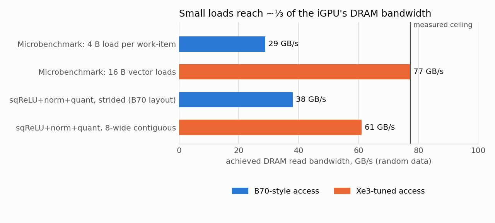
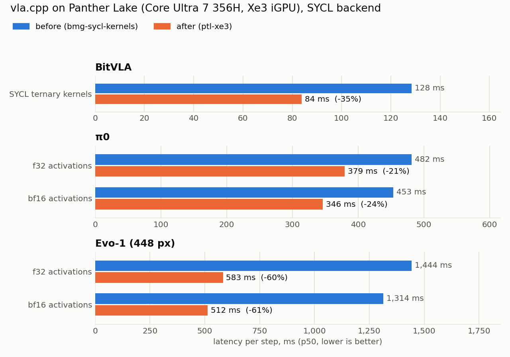
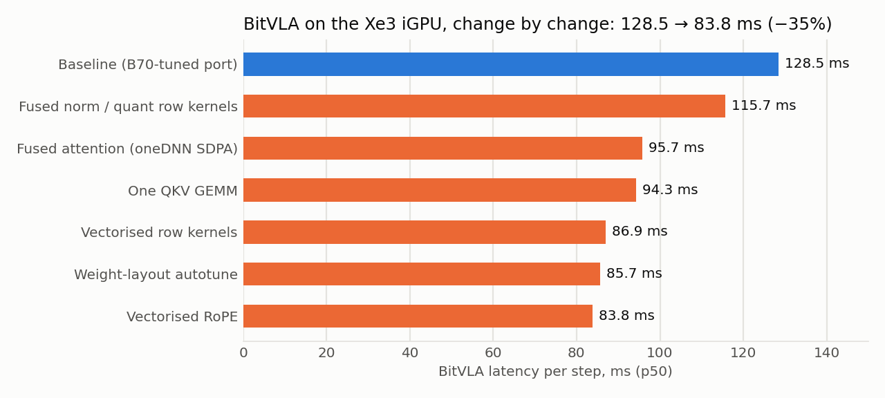
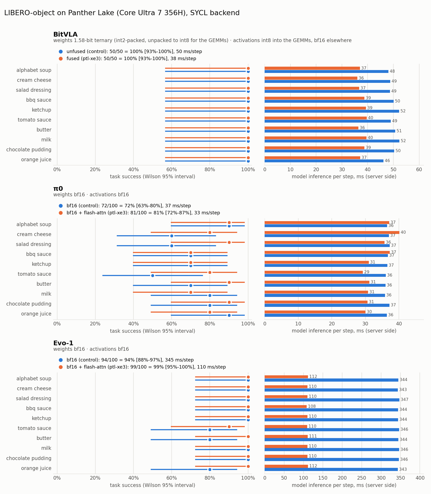

# `vla.cpp` on Panther Lake (Xe3 iGPU)

Notes for running `vla.cpp` on Intel Core Ultra series 3 (Panther Lake) and
what was changed to make it fast there. Everything here is the SYCL backend
(`docs/backend/sycl.md`) plus OpenVINO (`docs/backend/ov.md`); this page covers
what is different about the silicon and the numbers measured on it.

Measured on a **Core Ultra 7 356H** (Arch Linux, kernel 7.2, `xe` driver,
compute-runtime 26.31, oneAPI DPC++ 2026.0, oneDNN 3.11.3 built from source,
OpenVINO 2026.3.1).

## The part

| | Panther Lake 356H iGPU | Arc Pro B70 (where the SYCL port was tuned) |
|---|---|---|
| Architecture | Xe3 (`intel_gpu_ptl_u`, PCI `8086:b0a0`) | Xe2 (`bmg`) |
| Compute | 4 Xe3 cores = 32 XVE, SIMD16, 10 threads/XVE, 2.45 GHz | 256 XVE, 2.8 GHz |
| Sub-groups / SLM / L2 | 16 or 32 / 128 KiB / 4 MiB | 16 or 32 / 128 KiB / 18 MiB |
| Memory | unified LPDDR5x, ~117 GiB visible | 32 GiB GDDR6 |
| Measured read bandwidth | **~77 GB/s** (random data) | 577-596 GB/s |
| Measured int8 XMX (oneDNN, large GEMM) | **~37 TOPS** | 251-258 TOPS |
| Kernel launch round trip | 7.9 us | 4.7 us |

Roughly 7x less compute and 8x less bandwidth than the B70, and - the part
that shapes everything below - a machine balance where **a single small load
per work-item only reaches ~29 GB/s**; the 77 GB/s ceiling takes 16-byte loads.
Kernels tuned for the B70 that move one bf16 per work-item per loop trip run at
a third of what the part can do here.



The CPU (16 cores, AVX-VNNI) and the NPU (`/dev/accel/accel0`) share the same
memory.

## Setup on a distro install (Arch shown)

```bash
sudo pacman -S intel-oneapi-dpcpp-cpp intel-oneapi-mkl intel-oneapi-mkl-sycl \
               intel-compute-runtime level-zero-loader cmake ninja \
               opencl-headers opencl-clhpp clinfo intel-gpu-tools intel-pti \
               openvino openvino-intel-gpu-plugin openvino-intel-npu-plugin \
               intel-npu-driver python-huggingface-hub
sudo usermod -aG render "$USER"     # /dev/accel (NPU) is root:render 0660; re-login
```

Do **not** use the distro `onednn` package: it is built CPU-only, and the SYCL
build needs oneDNN's SYCL GPU runtime. Build it once, without root (GPU-only is
enough and builds in a fraction of the time):

```bash
source /opt/intel/oneapi/setvars.sh
git clone --depth 1 --branch v3.11.3 https://github.com/uxlfoundation/oneDNN.git
cmake -S oneDNN -B oneDNN/build -G Ninja -DCMAKE_BUILD_TYPE=Release \
      -DCMAKE_C_COMPILER=icx -DCMAKE_CXX_COMPILER=icpx \
      -DDNNL_CPU_RUNTIME=NONE -DDNNL_GPU_RUNTIME=SYCL -DDNNL_GPU_VENDOR=INTEL \
      -DDNNL_BUILD_TESTS=OFF -DDNNL_BUILD_EXAMPLES=OFF \
      -DCMAKE_INSTALL_PREFIX=$HOME/opt/vla-deps/onednn
cmake --build oneDNN/build && cmake --install oneDNN/build
```

`ci/local/common.sh` picks it up from `$DEPS_PREFIX/onednn` automatically, and
accepts the distro OpenVINO (no `setupvars.sh` needed).

## Build

```bash
SYCL_AOT=ptl-u,ptl-h ci/local/build.sh sycl     # native Xe3 code
ci/local/build.sh ov                             # OpenVINO (GPU / NPU)
```

`SYCL_AOT` (CMake: `-DVLA_SYCL_DEVICE_ARCH=ptl-u,ptl-h`) compiles native device
code for the listed parts at build time and keeps SPIR-V for any other GPU; it
is forwarded to ggml-sycl's `GGML_SYCL_DEVICE_ARCH`. Without it every kernel is
JIT-compiled on first use: BitVLA's first request on a cold driver cache took
1472 ms JIT against 452 ms AOT (steady state is the same either way; what is
left of the first request is oneDNN's own kernel generation and the one-time
weight unpack). The AOT build takes roughly twice as long.

## Results

`vla-bench` p50, one 224x224 view (448 for Evo-1), 16 tokens. "Before" is the
`bmg-sycl-kernels` branch as it arrived, on the same machine.

| model | backend / mode | before | after | change |
|---|---|---:|---:|---:|
| BitVLA | SYCL ternary kernels | 128.5 ms | **83.8 ms** | -35% |
| BitVLA | OpenVINO GPU, q8_0, f16 | 228.6 ms | - | (SYCL is 2.7x faster) |
| pi0 | SYCL, bf16 act, `--flash-attn 1` | 453 ms | **346 ms** | -24% |
| pi0 | SYCL, f32 act, `--flash-attn 1` | 481 ms | **379 ms** | -21% |
| Evo-1 | SYCL, bf16 act, `--flash-attn 1` | 1314 ms | **512 ms** | -61% |
| Evo-1 | SYCL, f32 act, `--flash-attn 1` | 1443 ms | **583 ms** | -60% |





Regenerate with `python scripts/plot_ptl_sycl.py` (any python with matplotlib,
e.g. the LIBERO venv).

## What changed, and why

### BitVLA's ternary stack (`src/kernels/bitvla/sycl/`)

A unitrace of one request on this part put the row and elementwise kernels at
~40% of device time, each already at the DRAM ceiling: the cost was
round-tripping bf16 intermediates, not arithmetic.

- **Fused row kernels** (`bitvla_fused.h`): add+RMSNorm+act_quant,
  sqReLU*up+RMSNorm+quant, bias+residual+LayerNorm+quant, bias+GELU+quant_pad.
  The FFN's residual is deferred into the next layer's input norm. Each work-item
  owns contiguous 8-element chunks (16-byte loads, 8-byte int8 stores) held in
  registers for all passes.
- **Fused attention** (`attention.h`): oneDNN Graph's SDPA micro-kernel reading
  Q/K/V in place through 5-D strided views (a size-1 broadcast dim gives GQA),
  with RoPE applied in place on the row-major planes (8 pairs per work-item). Replaces three transposes,
  two RoPE launches, two repeat_kv, two batched GEMMs and an [H,S,S] scores plane.
- **One QKV GEMM** (`bitvla_ternary_gemm_cat3`): the LM's 640-wide k/v
  projections ran at half the XMX rate on their own.
- **Weight layout autotuning**: each fused GEMM shape is timed once against a
  oneDNN-chosen blocked weight layout and keeps the faster (exact int32
  accumulation, so both give the same bits). The LM QKV GEMM: 286 -> 180 us.

What is left: the ternary GEMMs are ~30 TOPS at M=330, ~80% of the measured
37 TOPS ceiling, and they are ~65% of the request.

### The ggml graph models (pi0, Evo-1)

- **`GGML_OP_FLASH_ATTN_EXT` on oneDNN's SDPA** (`src/sycl/vla_sycl_attn.cpp`),
  claimed in the existing ggml-sycl hook. ggml-sycl's own FA is slower than the
  unfused graph on this part. Q/K/V go to F16 once (ggml's FA does the same to
  K/V); the output is written F16 and widened afterwards, because oneDNN only
  picks the fused micro-kernel when output and input types match.
- **No casts or copies ahead of FA** (`vla::fa_takes_views()`): on SYCL the
  graphs hand FA strided views of the projections instead of F32-casting and
  `ggml_cont`-ing each operand. Bit-identical.
- **Evo-1's LM and DiT attention** gained FA branches; the LM's 14 unfused
  softmaxes over a ~1041^2 score plane were 12.7 ms each.

## Accuracy

| change | effect | how it is gated |
|---|---|---|
| fused row kernels | quantised value can differ by 1 on an exact rounding boundary (1 in 4M in the tests); residual stream exact | `test_bitvla_ops_gpu` |
| BitVLA QKV GEMM, layout autotune, FA views | none (bit-identical) | stage dumps, `compare_actions` = 0 |
| BitVLA fused attention | more accurate than the chain: LM max err 0.0024 vs 0.0114 against an exact evaluation | `test_bitvla_ops_gpu`; LIBERO 50/50 vs 50/50 |
| pi0 FA | actions move 0.025 normalised vs the unfused bf16 graph (bf16 itself: 0.076 vs f32) | `compare_actions`; LIBERO 81/100 vs 72/100 |
| Evo-1 FA | f32+FA: 0.0030 vs the f32 reference; bf16+FA: 0.014 (bf16 alone: 0.009) | `compare_actions`; LIBERO 99/100 vs 94/100 |

BitVLA's actions cannot be judged by `compare_actions`: a one-bf16-step change in
0.5% of the ViT output already moves them ~0.15 normalised, because the int8
activation quantisers amplify any perturbation. Its gate is LIBERO success, and
it passes: LIBERO-object, 10 tasks x 5 episodes (`ci/local/libero_ptl.sh`),
fused **50/50** against the unfused control's 50/50, at 37 ms vs 52 ms of
server-side inference per step.

pi0, 10 tasks x 10 episodes: bf16 + flash attention **81/100** (Wilson 95%
72-87%) against the bf16 control's 72/100 (63-80%). The intervals overlap on
every task, so this reads as no regression rather than an improvement.

Evo-1, 10 tasks x 10 episodes: bf16 + flash attention **99/100** (Wilson 95%
95-100%) against the bf16 control's 94/100 (88-97%), at 110 vs 345 ms of
server-side inference per step (3.1x) - again overlapping, no regression.



Regenerate with `scripts/plot_libero_ptl.py` (arguments in its docstring).

## NPU (OpenVINO, `GGML_OPENVINO_DEVICE=NPU`)

Status: **runs, but BitVLA's LM produces NaN actions** - not usable yet.

- The NPU ("Intel AI Boost") is visible to OpenVINO once the user is in the
  `render` group (`/dev/accel/accel0` is `root:render 0660`), after a fresh login.
- BitVLA compiles and runs: 392 ms (bf16 weights), 513 ms (q4_0), 541 ms
  (q8_0), against 84 ms for the SYCL path on the GPU - so even when correct it
  would be a power/offload option, not a latency one.
- The ViT is finite and within 4% of the GPU; the LM goes NaN. The NPU compiles
  the whole graph at f16, and RMSNorm's wide sum of squares overflows there.
  `GGML_OPENVINO_RMS_FUSION=10` (now the default on the NPU) rescales each row
  by its own max so the norm cannot overflow - verified correct on the GPU at
  f16 (actions within 0.025 of the default) - but the NPU still produces NaN
  with it, with the f32-widened mode 2 and with bf16 weights, so a second op
  overflows as well (the squared-ReLU gate, relu(g)^2 * u, is the first
  suspect). Next step: bisect the LM graph op by op on the NPU.

## Switches

| variable | effect |
|---|---|
| `VLA_BITVLA_UNFUSED=1` | BitVLA: the original per-op chain |
| `VLA_BITVLA_NO_SDPA[_LM\|_VIT]=1` | BitVLA: unfused attention, per tower |
| `VLA_BITVLA_STRIDED_ROWS=1` | BitVLA: strided row kernels, bit-identical to the chain |
| `VLA_BITVLA_GEMM_LAYOUT=plain\|blocked` | BitVLA: pin the weight layout instead of autotuning |
| `VLA_SYCL_NO_SDPA=1` | ggml models: ggml-sycl's own flash attention |
| `GGML_OPENVINO_DEVICE=NPU` | OpenVINO on the NPU (needs the `render` group) |
| `GGML_OPENVINO_RMS_FUSION=10` | OpenVINO: max-scaled RMSNorm that cannot overflow at f16 (default on NPU) |
