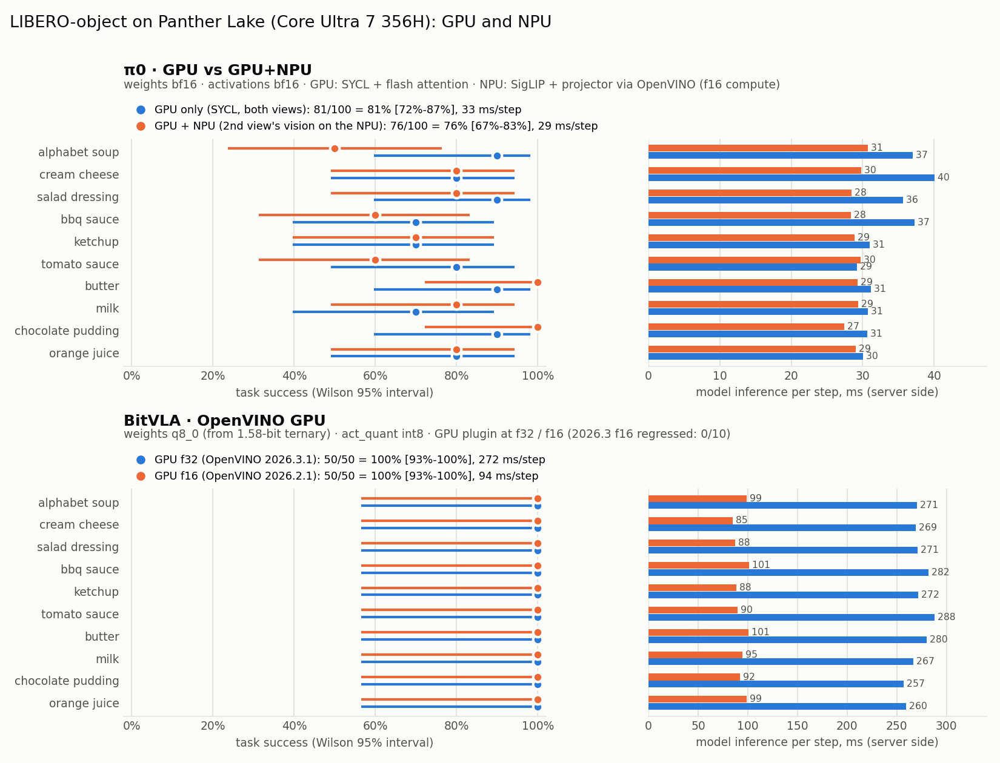

# Panther Lake: what runs on the GPU and the NPU

Short status for vla.cpp on a Core Ultra 7 356H (Xe3 iGPU + NPU 5, "Intel AI
Boost"). Details and method: [ptl.md](ptl.md). All numbers on this machine;
LIBERO-object, 10 tasks.



## GPU (Xe3 iGPU)

| path | model | status | LIBERO | latency |
|---|---|---|---|---|
| SYCL | BitVLA | **works**, recommended | 50/50 | 84 ms/request (was 128) |
| SYCL | pi0 (bf16) | **works**, recommended | 81/100 | 346 ms (was 453) |
| SYCL | Evo-1 (bf16) | **works**, recommended | 99/100 | 512 ms (was 1314) |
| SYCL | pi0.5 (f32) | **works** | not run | 458 ms (was 570) |
| OpenVINO 2026.3.1 | BitVLA f32 | works | 50/50 | 272 ms/step |
| OpenVINO 2026.3.1 | BitVLA f16 | **broken** (plugin regression) | 0/10 | - |
| OpenVINO 2026.2.1 | BitVLA f16 | works | 50/50 | 94 ms/step |

The SYCL backend is the fast path on this part. On OpenVINO, use f32 with the
distro 2026.3, or f16 with a local 2026.2 runtime (how: [ptl.md](ptl.md)).

## NPU

| what | status |
|---|---|
| **pi0, 2nd camera view's vision encoder on the NPU** (prototype) | **works**: LIBERO 76/100 (GPU-only 81/100, intervals overlap); request 556 -> 486 ms (-12.5%), vision 138 -> 86 ms |
| pi0 SigLIP vision tower alone | **works**: matches f32 CPU to 5e-4 relative; 58.6 ms per view (GPU ~54 ms) |
| BitVLA, whole model | runs (390-610 ms) but **actions wrong** - f16 rounding amplified by the int8 quantisers; NaN fixed, noise not |
| pi0, whole model | runs (643 ms) but **NaN** - Gemma's activations overflow f16 |
| Evo-1 | **does not compile** on the NPU driver |

So today the NPU is useful as a **vision co-processor**: with two or more
camera views it encodes one in parallel with the GPU. Whole policies on the NPU
are blocked by f16 numerics in their language models.

### Running the pi0 vision offload (prototype)

```bash
# once: export pi0's vision graph as OpenVINO IR (writes IR_naive_0.xml/.bin)
GGML_OPENVINO_DEVICE=NPU GGML_OPENVINO_DUMP_IR=1 VLA_IMG_SIZE=224 \
    build-ov/tests/vla_predict_check pi0.gguf "" 1
python scripts/npu_vision_worker.py --ir IR_naive_0.xml --sock /tmp/pi0_npu.sock &
VLA_PI0_NPU_VISION=/tmp/pi0_npu.sock build-sycl/vla-server ... # needs 2+ views
```

If the worker is unreachable, pi0 logs it once and encodes that view on the GPU.

## Fixes made along the way (OpenVINO, all in `scripts/patch_ggml_openvino.py`)

- act_quant computed in an f16-safe order (inf scale on all-zero rows -> NaN)
- RMSNorm mode 10: per-row max-scaled, cannot overflow at f16
- RoPE from f32 host tables (f16 angles were off by up to 0.125 rad)
- BitVLA's FFN gate pre-scaled on OpenVINO (relu(g)^2*u overflowed f16)
- numbered IR dumps; opt-in fused fp16 attention (`VLA_BITVLA_OV_FA=1`)
