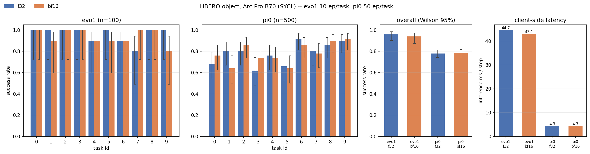
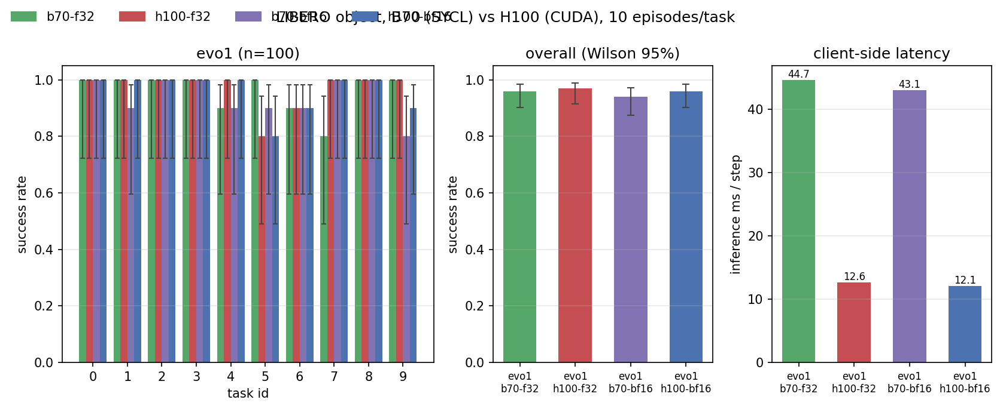
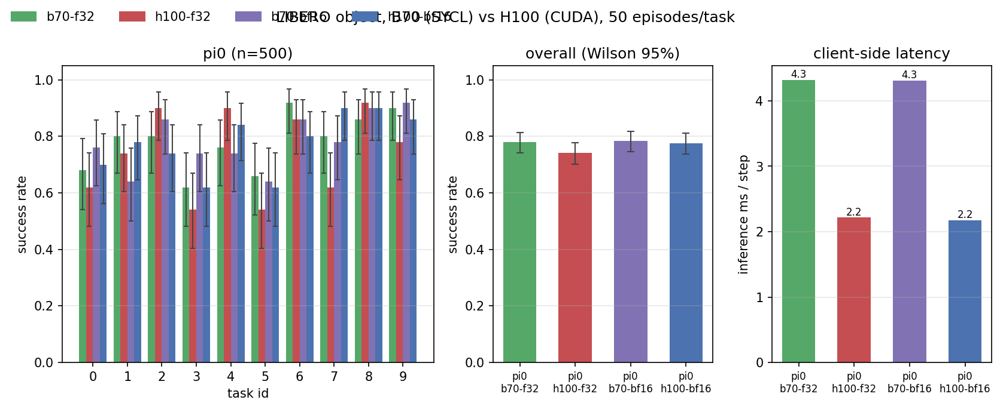
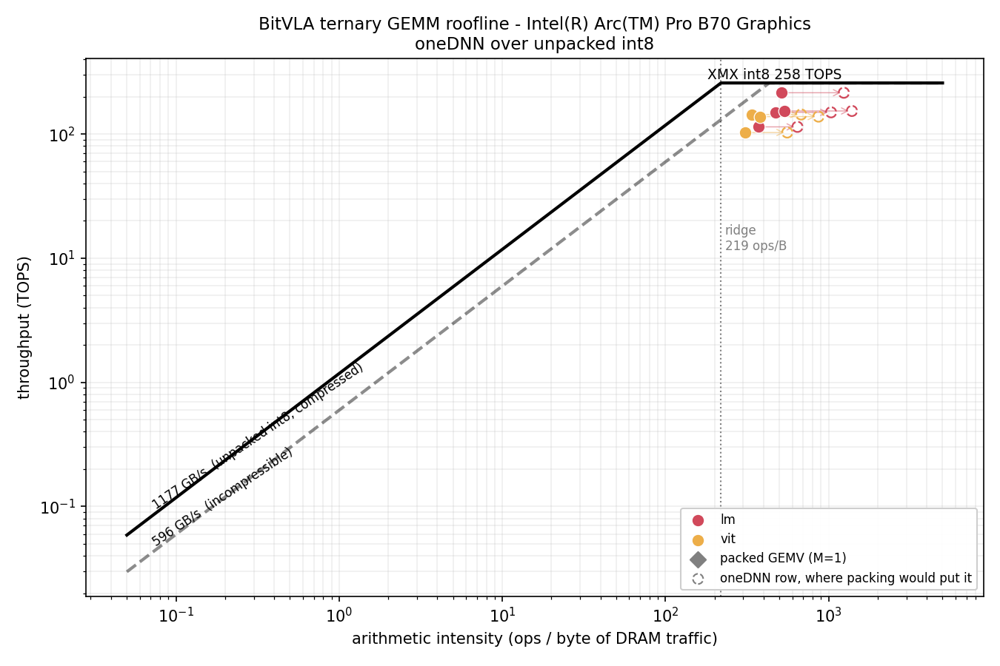
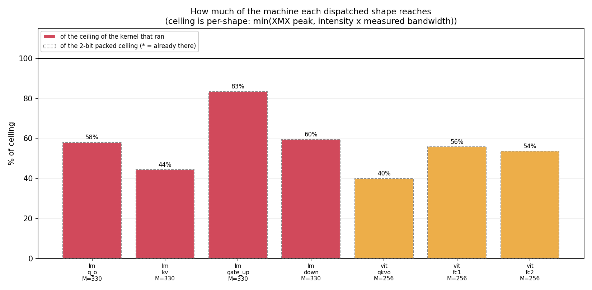

# `vla.cpp` on Intel GPUs (SYCL backend)

Notes for building and running `vla.cpp` on Intel discrete and integrated GPUs
through oneAPI SYCL. Unlike Metal, SYCL is **not** auto-detected: it needs the
oneAPI DPC++ compiler and an explicit `-DGGML_SYCL=ON`.

Verified on an **Intel Arc A380** (DG2 / Xe-HPG, `8086:56a5`, 6 GB) on Ubuntu
22.04, kernel 6.8, with an AMD Ryzen host CPU. The same path covers the rest of
the Arc A/B series, Flex, Data Center Max, and the Xe iGPUs.

## Prerequisites

### 1. GPU compute runtime

The kernel driver (`i915`, in-tree since 6.2 for DG2) is not enough - you also
need the userspace compute stack: Level Zero plus the NEO OpenCL runtime.

```bash
wget -qO- https://repositories.intel.com/gpu/intel-graphics.key \
  | sudo gpg --yes --dearmor -o /usr/share/keyrings/intel-graphics.gpg
echo "deb [arch=amd64 signed-by=/usr/share/keyrings/intel-graphics.gpg] https://repositories.intel.com/gpu/ubuntu jammy client" \
  | sudo tee /etc/apt/sources.list.d/intel-gpu-jammy.list
sudo apt-get update
sudo apt-get install -y intel-opencl-icd libze-intel-gpu1 libze1 libze-dev intel-ocloc clinfo
```

Substitute your distro codename for `jammy`. Install the userspace packages
only - do **not** add `intel-i915-dkms` on a 6.8+ kernel, whose in-tree `i915`
already drives DG2.

Then give your user access to the render node and re-login:

```bash
sudo usermod -aG render,video "$USER"
```

Check it before going further - `clinfo -l` must name your GPU:

```
Platform #0: Intel(R) OpenCL Graphics
 `-- Device #0: Intel(R) Arc(TM) A380 Graphics
```

### 2. oneAPI

The SYCL backend needs the DPC++ compiler, oneMKL and oneDNN. **Deep Learning
Essentials** carries exactly those and is much smaller than the full Base
Toolkit.

```bash
wget -qO- https://apt.repos.intel.com/intel-gpg-keys/GPG-PUB-KEY-INTEL-SW-PRODUCTS.PUB \
  | sudo gpg --yes --dearmor -o /usr/share/keyrings/oneapi-archive-keyring.gpg
echo "deb [signed-by=/usr/share/keyrings/oneapi-archive-keyring.gpg] https://apt.repos.intel.com/oneapi all main" \
  | sudo tee /etc/apt/sources.list.d/oneAPI.list
sudo apt-get update
sudo apt-get install -y intel-deep-learning-essentials-2025.3
```

2025.3 is the newest release verified by llama.cpp's own SYCL docs that still
supports Ubuntu 22.04; the 2026.x series dropped jammy. Confirm the toolchain
sees the GPU over Level Zero:

```bash
source /opt/intel/oneapi/setvars.sh
sycl-ls
```

```
[level_zero:gpu][level_zero:0] Intel(R) oneAPI Unified Runtime over Level-Zero, Intel(R) Arc(TM) A380 Graphics 12.56.5 [1.6.31294+20]
[opencl:gpu][opencl:1] Intel(R) OpenCL Graphics, Intel(R) Arc(TM) A380 Graphics OpenCL 3.0 NEO  [24.39.31294]
```

Plus the usual host dependencies. Ubuntu 22.04 has no `cppzmq` package, so drop
its two headers in by hand:

```bash
sudo apt-get install -y cmake ninja-build pkg-config \
    protobuf-compiler libprotobuf-dev libzmq3-dev
wget -q https://github.com/zeromq/cppzmq/archive/refs/tags/v4.10.0.tar.gz -O - | tar xz
sudo install -m644 cppzmq-4.10.0/zmq.hpp cppzmq-4.10.0/zmq_addon.hpp /usr/local/include/
```

## Configure & build

ggml's SYCL sources only compile under the oneAPI DPC++ driver, and
`CMAKE_CXX_COMPILER` is global, so the whole project - `vla_core`, the servers,
the CLI - is built by `icpx`. Configure a **fresh** build directory; switching
compilers in an existing one does not work.

```bash
source /opt/intel/oneapi/setvars.sh

cmake -B build-sycl -G Ninja \
    -DCMAKE_BUILD_TYPE=Release \
    -DGGML_SYCL=ON \
    -DCMAKE_C_COMPILER=icx \
    -DCMAKE_CXX_COMPILER=icpx
cmake --build build-sycl -j$(nproc)
```

`setvars.sh` must be sourced in every shell that builds *or runs* the binaries -
`libsycl.so`, `libdnnl.so` and the oneMKL libraries live under `/opt/intel`.

## GPU offload

The core picks its backend at load time. Confirm from the startup banner:

```
vla: backend = SYCL (device 0: Intel(R) Arc(TM) A380 Graphics)
```

If you see `vla: backend = CPU (8 threads)` instead, the build did not pick up
SYCL, or no SYCL device was visible - re-check `sycl-ls` and your `render` group
membership.

On a multi-GPU box, `VLA_DEVICE=<n>` selects the ordinal (the same variable
selects the CUDA device). The index is range-checked against the SYCL device
count; an out-of-range value logs and falls back to CPU rather than running off
the end of the device array.

> Single-backend, no per-op CPU fallback: the core drives one backend through
> `gallocr`, not a scheduler. An arch that hits an op the SYCL backend does not
> implement asserts at predict time rather than silently falling back.

BitVLA is the one exception to the single-backend rule, but no longer to GPU
support: it pins its ggml graph to the CPU backend by design and offloads its LM,
ViT and action head through separate hand-written kernels. Those kernels now have
a SYCL implementation (`src/kernels/bitvla/sycl/`) alongside the CUDA original, so
a SYCL build runs BitVLA on the GPU. See [BitVLA on Battlemage](#bitvla-on-battlemage).

## Known issue: the SYCL VMM pool and oneDNN

ggml-sycl's VMM pool hands out virtual-memory-backed pointers that oneDNN cannot
wrap in a `dnnl::memory`. When it happens the GEMM aborts the process:

```
could not create a memory object
SYCL error: ... in function ggml_sycl_op_mul_mat at .../ggml-sycl.cpp:3055
```

It fires whenever `src0` is not already F32 - BF16, F16 and every quantized type
are converted into that pool before the GEMM - which is most checkpoints,
including the default BF16 weights of SmolVLA, π0, π0.5, Evo-1, VLA-Adapter and
OpenVLA-OFT.

`vla.cpp` defaults `GGML_SYCL_ENABLE_VMM=0` when it brings up SYCL, which avoids
it and is the faster of the two workarounds (disabling oneDNN with
`GGML_SYCL_ENABLE_DNN=0` also clears the crash, but costs ~8%). It is only a
default: set `GGML_SYCL_ENABLE_VMM=1` explicitly to keep the pool on hardware
where it pays off.

## Fixed upstream: `bf16 -> f32` copies

ggml-sycl's copy table used to have `f16 -> f32` but no `bf16 -> f32`, so an arch
whose graph contained that copy aborted at predict time. VLA-Adapter hit it with
its default BF16 weights, and the workaround was `VLA_ADAPTER_F32_WEIGHTS=1`.

llama.cpp b10326 adds the missing kernel (`cpy_1_bf16_f32` in
`ggml/src/ggml-sycl/cpy.cpp`), so VLA-Adapter should run on stock BF16 weights
now. Not yet re-tested on the A380 - if you hit the old abort, fall back to
`VLA_ADAPTER_F32_WEIGHTS=1` and file an issue.

## Performance note: F32 weights (Xe-HPG only)

BF16 has no native DPAS path on Xe-HPG, so BF16 weights are slower there than
plain F32 despite the extra bandwidth.

**This does not carry to Battlemage.** Xe2 has native BF16 DPAS - measured at
116-143 TFLOPS on a B70, against 251-258 TOPS for int8 - so the reason for the
switch below is gone on that part, and the table underneath it is an A380
measurement that should not be read as a general recommendation. On Xe2 leave the
default BF16 weights alone; F32 doubles the resident footprint to buy nothing.

Each arch exposes a switch
(`VLA_WEIGHT_DTYPE=f32` for SmolVLA, `VLA_PI0_F32_WEIGHTS=1` for π0, and so on),
and on the A380 it is worth ~16%:

| SmolVLA weights | vision | inference | total |
|---|---:|---:|---:|
| BF16 (default) | 158 ms | 474 ms | **630 ms** |
| F32 (`VLA_WEIGHT_DTYPE=f32`) | 173 ms | 355 ms | **528 ms** |

The tradeoff is memory - F32 doubles the resident weights (1.07 GiB -> 2.09 GiB
for SmolVLA), which matters on a 6 GB A380 for the larger checkpoints. The
default stays BF16 for that reason.

## Results

Measured with `vla_predict_check`, which is a test target - add
`-DVLA_BUILD_TESTS=ON` to the configure line above to get it. Fixed noise, so
runs are comparable; best of 5-10 iterations after 3 warmups. Host is an AMD Ryzen 5 5500 (CPU backend uses 8
threads); GPU is the Arc A380.

| Model | input | CPU | Arc A380 | speedup |
|---|---|---:|---:|---:|
| SmolVLA     | 512 | 1,920 ms | **630 ms** | 3.0x |
| Evo-1       | 448 | 7,695 ms | **1,176 ms** | 6.5x |
| VLA-Adapter | 224 | 2,994 ms | **517 ms** | 5.8x |

VLA-Adapter is measured with `VLA_ADAPTER_F32_WEIGHTS=1` on both sides, which was
required at the time (see the `bf16 -> f32` section above); the others run their
stock defaults.

Per-stage for SmolVLA:

| Stage | CPU | Arc A380 (SYCL) |
|--------------|-------------:|------------------:|
| vision       |    1,119 ms  |          158 ms  |
| inference    |      804 ms  |          474 ms  |
| **total/req**|  **1,920 ms**|      **630 ms**  |

SmolVLA gains least because its flow-matching denoise loop is a long chain of
small GEMMs that cannot fill 128 EUs; its vision tower alone is 7.1x. With
`VLA_WEIGHT_DTYPE=f32` it reaches 528 ms (3.6x).

Outputs were checked against the CPU backend on every model above: max absolute
deviation 2.9e-3 on actions peaking at 0.99 (2.9e-6 for the all-F32
VLA-Adapter run), RMS 2.4e-4 - BF16/F32 kernel rounding, not a numerical
regression.

### Memory ceiling

The A380 has 6 GB, of which ~5.7 GB is addressable. GR00T N1.7 (6.3 GB of F32
weights) does not fit and dies in the allocator:

```
level_zero backend failed with error: 38 (UR_RESULT_ERROR_OUT_OF_HOST_MEMORY)
```

`--weight-dtype bf16` (now the default) halves the weights but its activations still overflow
the card. There is no host-memory spill path - the core is single-backend - so
the larger checkpoints need an A770/B580-class card or better.

## Trap: icpx defaults to fast floating point

`icpx` is not `clang++` with a SYCL flag - it defaults to **`-fp-model=fast`**,
where `nvcc` defaults to precise and needs `--use_fast_math` to opt out. Ported
kernels that reproduce a CUDA formula literally will still not reproduce its
numerics unless the model is set back:

```
-fp-model=precise -foffload-fp32-prec-div -foffload-fp32-prec-sqrt
```

Every SYCL target in `CMakeLists.txt` carries all three. The two `-foffload-`
flags are the ones that are easy to miss: `-fp-model=precise` governs the host
compilation, and without them device-side division and square root stay
approximate.

Even with them, **SYCL float division is ~2.5 ULP on device** - the hardware
reciprocal is the only thing the spec guarantees, and it is not IEEE. Where a
division feeds a quantisation scale that is not good enough, because the
error lands on the wrong side of a rounding boundary and changes an integer. The
fix is source-level, not a flag: `vla::bitvla::exact_div` in
`src/kernels/bitvla/sycl/sycl_compat.h` refines the reciprocal with one Newton
step and a residual correction, reaching ~0.5 ULP. Use it wherever a divide's
result is rounded or compared, not everywhere.

### The same defect was already in the CUDA source

The framing above - `icpx` is loose, `nvcc` is precise - is true of the defaults
and wrong about this build. The BitVLA CUDA target opts out, at
`CMakeLists.txt:186`:

```cmake
$<$<COMPILE_LANGUAGE:CUDA>:-O3 --use_fast_math -Xptxas=-O3>
```

`--use_fast_math` implies `-prec-div=false`, so CUDA's `/` is an approximate
reciprocal and multiply - exactly what SYCL was being blamed for. The port's
`test_bitvla_gemm_gpu` was written on the SYCL side and had never been run under
CUDA. Run there, it failed all eleven dispatched shapes on **the same two bit
patterns**: `127.0f/amax` returning `0x42295556` where the correctly-rounded
value is `0x42295555`. One ULP, arrived at by two unrelated routes.

Nothing downstream had caught it, for a reason worth noting: not one quantised
int8 moved. The error is far below a bf16 step, `nearbyintf` absorbed it in the
quantiser, and `__float2bfloat16` absorbed it again in the GEMM epilogue. It was
visible only because the scale is stored as raw f32 and the epilogue divides by
it a second time - and because a test compared that f32 bitwise rather than
within a tolerance. **A tolerance-based check on the outputs would have passed on
every shape.**

The CUDA fix is one instruction, since the hardware has a correctly-rounded
divide and `--use_fast_math` does not rewrite intrinsics:

```cpp
__device__ __forceinline__ float vla_exact_div(float a, float b) {
    return __fdiv_rn(a, b);   // src/kernels/bitvla/cuda_compat.h
}
```

Applied at the four ternary-scale sites in `bitnet_kernels.h` and at the fp32
action head's layernorm in `bitvla_fp32_ops_cuda.cu`, where the output is f32 and
there is no bf16 rounding to hide behind. `cuda_compat.h` and `sycl_compat.h` now
hold the same guarantee, each stated in its own backend's terms.

**What it costs, measured rather than assumed.** The comment committed with the
fix said the cost was "not measurable". That was reasoned from the call-site
count and it was wrong: the epilogue divides once per *output element*, order
238M times per request. `ci/slurm/h100_exact_div_ab.sbatch` builds three variants
on one node, back to back, so the divide is the only variable:

| variant | total/req | vision | shapes passing `bitvla_gemm_gpu` |
|---|---:|---:|---|
| `__fdiv_rn` - correctly rounded, shipping | 23.4 ms | 7.1 ms | 11 / 11 |
| `a / b` under `--use_fast_math` | 22.0 ms | 6.5 ms | **0 / 11** |
| Markstein FMA sequence | 23.3 ms | 7.1 ms | 11 / 11 |

So the guarantee costs **6.4%** on H100, and the middle row is not an option -
it is the bug, priced. The useful part is the third row: Markstein was tried
because its reciprocal refinement depends only on the divisor and should hoist
out of the epilogue's row loop, leaving three cheap FMAs per element. It does
not show up as a win, so CUDA keeps the one-instruction form. SYCL keeps
Markstein for the opposite reason - Battlemage has no correctly-rounded divide
to call at all. Same guarantee, different hardware, different route.

There is a way out of the 6.4% that was **not** taken: `act_quant` could store
`amax/127` alongside `127/amax` and let the epilogue multiply instead of divide.
That is not bit-identical to dividing, so it would change the reference on both
backends and in the CPU check - a redefinition of the op, not an optimisation of
it, and not a call to make quietly while claiming bit-exactness.

The lesson generalises past this divide. A port is usually treated as a debt owed
to the original, and the tests written for it as a way to prove the new backend
has not lost anything. Those tests run against both backends, and they are
frequently stricter than anything the original ever faced - the exactness claim
here came from the ternary GEMM being integer arithmetic, which is a property of
the *model*, not of Intel. **The port is a second reader of the reference
implementation, and it will find things.**

## BF16 activations (`--act-dtype bf16`)

Evo-1 and π0 can run their weight GEMMs, bias adds, residuals, elementwise ops
and norms in BF16 while keeping attention scores, softmax, RoPE, the patch-embed
convolutions and the flow-matching integrator in F32 - the split
`torch.autocast(bfloat16)` makes. `src/act_dtype.h` holds it; the arch opts in and
`--act-dtype bf16` (or `VLA_EVO1_BF16_ACT` / `VLA_PI0_BF16_ACT`) turns it on.

ggml cannot express this on its own: `ggml_mul_mat` hard-codes an F32 result, so
`vla::mul_mat_t` builds the node by hand with an explicit type, and the backend
then has to have a kernel for it. On CUDA that meant writing seven ops
(`src/cuda/vla_cuda_bf16.cu`, ~740 lines). **On SYCL it meant writing four**,
because `ggml-sycl` is materially further along on BF16 than `ggml-cuda`:

| op | `ggml-sycl` at b10729 | vla |
|---|---|---|
| ADD, MUL | BF16xBF16 and BF16xF32 already instantiated in `binbcast.cpp` | declines |
| SILU, RELU, GELU, GELU_ERF | `dispatch_ggml_sycl_op_unary` covers BF16 behind `GGML_SYCL_HAS_BF16`, which icpx always defines | declines |
| NORM, RMS_NORM | asserts F32 | `src/sycl/vla_sycl_bf16.cpp` |
| SCALE | asserts F32 | same |
| MUL_MAT | has a bf16 path, but passes oneDNN a `to_dt<float>()` destination unconditionally - for a BF16 `dst` that is the wrong type in twice the reserved bytes | same, via `dnnl::matmul` |

Re-implementing what already works would mean carrying a second, less-tested copy
of a kernel for no measured gain, so the entry point declines those ops by not
listing them. `tests/test_bf16_sycl_ops.cpp` runs an eight-op chain, which means a
pass also checks that the declined ops really do land on ggml-sycl's own kernels.

ggml has no way to register kernels for built-in ops (`GGML_OP_CUSTOM` is
CPU-only), so the fetched tree carries one null-by-default function pointer
consulted at the top of `ggml_sycl_compute_forward`. That, plus turning one
`GGML_ASSERT` pair in `fusion.cpp` into a `return false` so a BF16 `rms_norm`
declines the RMS_NORM+MUL fusion instead of aborting, is the entire ggml
modification - two edits, against the CUDA hook's four.
`scripts/patch_ggml_sycl_ext_hook.py` applies them and is idempotent. The other
two CUDA edits have no counterpart: `ggml_sycl_fuse()` is topk-moe only, so there
is no fused binbcast to intercept, and the UNARY+MUL check already declines on
non-F32/F16 rather than asserting.

### Precision

BF16 activations are a lossy choice on any backend, so the deviation from F32 is
the point of the feature, not a defect. `ci/slurm/bmg_bf16_e2e.sbatch` and
`ci/slurm/h100_bf16_e2e.sbatch` run identical arms and score both with
`ci/compare_actions.py`, so the comparison is of numbers rather than of two
scripts.

**Do not score a backend's BF16 arm against its own F32 arm.** That was the
original design here and it is wrong, because the two backends' F32 arms are not
the same precision. `ggml-cuda` calls `cublasSetMathMode(...,
CUBLAS_TF32_TENSOR_OP_MATH)` on every handle it creates
(`ggml-cuda/common.cuh`) - unconditionally, with no env guard - so CUDA's "F32"
GEMMs run on TF32 tensor cores at a 10-bit mantissa. `ggml-sycl`'s equivalent
`dnnl::fpmath_mode::f16` hint is behind `GGML_SYCL_F16` (`ggml-sycl/gemm.hpp`),
which is off in this build, and oneDNN's default fpmath is strict - so SYCL's
F32 is true fp32. Comparing each arm to its own baseline measures two different
things and flatters whichever backend has the weaker baseline.

The fix is a common reference. `VLA_DEVICE` out of range falls back to CPU
(`src/backend.h`, and `ggml_backend_cuda_init` rejects the index likewise), so
the same binary yields an fp32 reference with no vendor math mode in it at all.
Deviation from that reference, normalised against the chunk peak:

| | Evo-1 max_abs | Evo-1 rms | π0 max_abs | π0 rms |
|---|---:|---:|---:|---:|
| CUDA f32 (i.e. TF32) | 0.0045 | 0.000385 | 0.0116 | 0.000309 |
| SYCL f32 (true fp32) | 0.0035 | 0.000345 | **0.0020** | **0.000094** |
| CUDA bf16 | 0.0077 | 0.000897 | 0.0217 | 0.000832 |
| SYCL bf16 | 0.0104 | 0.001359 | 0.0260 | 0.000835 |

Read that as: the two BF16 paths are equivalent on π0 (0.000832 vs 0.000835) and
SYCL is ~1.5x wider on Evo-1. Since a large share of the Evo-1 gap is the
reproducibility floor below, the honest claim is *comparable*, not that either
backend's BF16 is systematically better. TF32 is visible but small - it costs
CUDA about 3x on π0 (0.000309 against SYCL's 0.000094) and almost nothing on
Evo-1.

Two further things make the numbers readable, both measured rather than assumed.

First, **the SYCL path is not bit-reproducible run to run and the CUDA path is**.
Two identical invocations differ by these amounts:

| control | Evo-1 | π0 |
|---|---:|---:|
| CUDA f32, CUDA bf16 | 0.000000 | 0.000000 |
| SYCL f32 (stock ggml-sycl) | 0.0030 | 0.0154 |
| SYCL bf16 (vla kernels) | 0.0065 | 0.0666 |

The stock F32 row is the one that assigns blame: none of `vla_sycl_bf16.cpp` is
reachable without `--act-dtype bf16`, so that nondeterminism is upstream of this
port. The BF16 row is larger, so the port does add some of its own. Any deviation
at or below those figures is not a statement about the dtype - and note π0's BF16
control exceeds the 0.06 tolerance the gate uses, which the gate does not catch
because it scores f32-vs-bf16 rather than the control.

Second, **the deviation is concentrated in one action dimension**: on π0 every
backend puts its worst element at step 45, dim 6 - the LIBERO gripper, which
saturates near ±1. The two F32 arms agree there to 6e-4 (CUDA -0.84560, SYCL
-0.84618); it is the point downstream of saturation that amplifies.
Per-dimension, π0's other six dims sit at max_abs ≤ 0.0053.

Cross-backend, CUDA-bf16 against SYCL-bf16: 0.0067 / 0.000787 on Evo-1 and
0.0046 / 0.000492 on π0.

### Performance

`vla-bench`, p50 of 20 reps after 3 warmups, via `ci/slurm/bmg_bf16_bench.sbatch`
and its CUDA twin `ci/slurm/h100_bf16_bench.sbatch`. p50 rather than min: min is
the one rep that dodged every scheduling hiccup.

| model | B70 f32 | B70 bf16 | B70 | H100 f32 | H100 bf16 | H100 |
|---|---:|---:|---:|---:|---:|---:|
| Evo-1 (448) | 183.0 ms | **172.7 ms** | **1.060x** | 52.7 ms | 50.0 ms | 1.054x |
| π0 (224) | 81.1 ms | 81.5 ms | **0.995x** | 31.2 ms | 30.2 ms | 1.033x |

Only the speedup columns are meant to be read across. The latency columns are two
different parts at two different power budgets and nothing here controls for
that.

Evo-1 gains 6.0%, and the gain is where it should be: vision is nearly flat (74.6
-> 73.5 ms) because the patch-embed convs stay F32 by design, so the LM and
action head went 108.4 -> 99.2 ms, 9.3%. That B70 and the H100 land within half a
percent of each other on the same model says the SYCL kernels are not leaving
anything on the table relative to the CUDA implementation they were ported from -
and CUDA had to earn its 1.054x against a TF32 baseline, which is the harder
denominator.

**π0 gains nothing on SYCL** - 0.5% slower, outside the run-to-run spread
(p90-min was 0.9 ms) but barely. Note this is specific to this backend, not to
the architecture: the same checkpoint, same sizes and same rep count gains 3.3%
on CUDA. π0's denoise loop is a chain of small GEMMs where the halved weight
traffic buys little and the BF16<->F32 conversions at the boundaries of the
F32-pinned ops cost about as much; on SYCL that trade comes out slightly
negative. Whether the difference is the conversion boundaries, oneDNN's
small-GEMM dispatch, or kernel launch overhead has not been profiled. BF16
activations are a per-arch and per-backend win, not a general one, which is why
they stay opt-in.

### Task success

Everything above is engine-side: action chunks scored against a reference, and
latency. Both can look fine while the policy quietly stops picking the object up.
`ci/slurm/bmg_libero_bf16.sbatch` closes that loop - `libero_object`, ten task
ids, N episodes each, f32 and bf16, on B70.



The same sweep on H100 is `ci/slurm/h100_libero_bf16.sbatch`, and both jobs draw
their own plots as they finish, into `docs/img/`:
[Evo-1 on B70](../img/libero_bf16_b70-evo1.png) ·
[π0 on B70](../img/libero_bf16_b70-pi0.png) ·
[Evo-1 on H100](../img/libero_bf16_h100-evo1.png) ·
[π0 on H100](../img/libero_bf16_h100-pi0.png).

| arm | successes | success rate | Wilson 95% | client ms/step |
|---|---:|---:|---:|---:|
| Evo-1 f32  | 96/100 | 0.960 | [0.902, 0.984] | 44.7 |
| Evo-1 bf16 | 94/100 | 0.940 | [0.875, 0.972] | 43.1 |
| π0 f32     | 390/500 | 0.780 | [0.742, 0.814] | 4.3 |
| π0 bf16    | 392/500 | 0.784 | [0.746, 0.818] | 4.3 |

Both arms of a model see the same task ids and the same episode count, so the
comparison is paired in tasks but not in seeds - LIBERO's initial states vary per
episode and the SYCL path is not bit-reproducible anyway (see the determinism
table above). Every cell is an independent binomial sample, which is why the
intervals are on the plot and why the two models are at different N.

**π0: no difference, and the story of how it got to n=500 is the useful part.**
The first sweep ran π0 at ten episodes per task and it looked like a regression -
83/100 for f32 against 76/100 for bf16. Seven episodes is a big enough gap to
chase even at p = 0.22, so it was chased, by re-running both arms at fifty
episodes per task. At n=500 the gap is two episodes *the other way*, z = -0.15,
p = 0.88.

What moved was the baseline: π0 f32 scored 0.830 at n=100 and 0.780 at n=500. The
first estimate was five points high and its own Wilson interval had said so -
[0.745, 0.891] contains 0.780 comfortably. The apparent BF16 deficit was one arm's
sampling noise. Ten episodes per task is enough to catch a policy that is broken
and not enough to rank two that are close; if a difference matters, buy the
episodes before writing the kernel.

**Evo-1: no difference resolved, and left at n=100.** Two episodes in 100,
z = 0.65, p = 0.52, with per-task splits that go both directions and cancel - bf16
wins task 7 (10/10 vs 8/10), f32 wins task 9 (10/10 vs 8/10) and task 1 (10/10 vs
9/10). Given what n=500 did to π0's baseline, read this row as "nothing detected
at this sample size" rather than as a measured 2-point cost; Evo-1 is 4x slower
per episode, which is the only reason it has not had the same treatment.

**BF16 activations are validated end-to-end on B70 for both Evo-1 and π0.** Note
what that does and does not say: task success is preserved, and on this backend
π0 gets no latency back for it (0.995x, above), so for π0 the flag is currently a
wash rather than a win.

### Cross-backend: does the port get the same policy?

Everything above compares B70 against itself. That is the wrong control for a
port. A kernel that is uniformly slightly wrong - a norm with the wrong epsilon,
a softmax that saturates early - is bit-identical to itself in both dtypes and
would pass every check on this page while quietly costing task success. The
control for a port is the backend it was ported *from*, running the same suite.

`ci/slurm/h100_libero_bf16.sbatch` is `bmg_libero_bf16.sbatch` with the CUDA
build and the `h100` partition. Same checkpoints, same ten `libero_object` task
ids, same episode count, same client.

| model | dtype | B70 (SYCL) | H100 NVL (CUDA) | z | p |
|---|---|---:|---:|---:|---:|
| Evo-1 | f32  | 96/100 (0.960) | 97/100 (0.970) | -0.38 | 0.70 |
| Evo-1 | bf16 | 94/100 (0.940) | 96/100 (0.960) | -0.65 | 0.52 |
| Evo-1 | both | 190/200 (0.950) | 193/200 (0.965) | -0.74 | 0.46 |
| π0 | f32  | 390/500 (0.780) | 371/500 (0.742) | +1.41 | 0.16 |
| π0 | bf16 | 392/500 (0.784) | 388/500 (0.776) | +0.31 | 0.76 |
| π0 | both | 782/1000 (0.782) | 759/1000 (0.759) | +1.22 | 0.22 |




Wilson 95% on the pooled rows: Evo-1 B70 [0.910, 0.973] against H100
[0.930, 0.983]; π0 B70 [0.755, 0.806] against H100 [0.732, 0.784]. Every pair
overlaps across most of its length.

**The two models disagree about which backend is ahead, and that is the useful
part.** Evo-1 puts H100 three episodes up, π0 puts B70 twenty-three up; pooled
over all 2400 episodes the gap is +20 in B70's favour at p = 0.31. A port that
had actually lost something would not produce a sign that flips between models -
it would show up on both, in the same direction, and worst on whichever model
leans hardest on the ported kernels. Two independent samples straddling zero is
what no difference looks like.

The largest single cell is π0 f32, where B70 leads by 3.8 points at p = 0.16.
Worth naming rather than burying, because it is the one row someone could quote
as "SYCL beats CUDA on task success". It should not be read that way: it is one
of six comparisons, it is not significant at any conventional threshold, and the
same checkpoint's bf16 arm shows +0.8 points. Note also that H100's own f32-vs-bf16
gap here is -1.26 (p = 0.21) in the *opposite* direction to B70's, which is the
clearest sign that what is being measured at this resolution is sampling noise on
both parts.

**Read this as "no difference detected", and know what that is worth.** At 80%
power and α = 0.05, the smallest regression each pooled row could reliably catch
is **7.2 points for Evo-1** (n=200/backend, base rate 0.965) and **5.6 points for
π0** (n=1000/backend, base rate 0.759). So this rules out a port that is
*broken* - a wrong reduction axis, a mis-strided RoPE, a dtype that silently
truncates - and it does not rule out a two-point cost on either model.

Note that π0 buys five times the episodes and gains only 1.6 points of
resolution. That is not a bad trade, it is the binomial: the standard error goes
as `sqrt(p(1-p)/n)`, so five times the episodes is 2.2x tighter, while moving the
base rate from 0.965 to 0.759 makes `p(1-p)` almost seven times larger and gives
most of it straight back. Resolution near the ceiling is cheap and resolution in
the middle is expensive, which is worth knowing before commissioning a sweep.

What makes the result more than one binomial sample is that it agrees with the
two measurements on either side of it. The engine-side deviation is already
bounded (max abs 2.9e-3, RMS 2.4e-4 against the CPU reference, same band as the
CUDA path), the BitVLA ternary path is bit-identical by construction, and the
policy is unchanged at the resolution the suite can see. Three independent
instruments, none of which is conclusive alone.

Latency is the honest part of the comparison and it is not close, but it is also
not uniform: Evo-1 runs at 44.7 client ms/step on B70 against 12.6 on H100
(3.5x), while π0 is 4.3 against 2.2 (2.0x), and BitVLA in the end-to-end table
below actually edges ahead. The spread across three models on the same two parts
is the point - it tracks how much of each model sits in first-party kernels
rather than in stock `ggml-sycl`, which is where the remaining headroom is.
Parity here is a claim about *what the policy does*, not about how fast it does
it.

## BitVLA on Battlemage (Arc Pro B70)

BitVLA does not run through `ggml-sycl`: it pins its graph to the CPU backend and
offloads the LM, ViT and action head through hand-written kernels. Those kernels
now exist for SYCL, so BitVLA runs on Xe2. Build as above; the ternary GEMM
currently goes through `dnnl::matmul` over weights unpacked to int8.

### How close to the ceiling

`tests/bench_bitvla_bmg` times every dispatched GEMM shape against ceilings it
measures on the same device in the same process, rather than against a spec
sheet. `scripts/plot_bmg_roofline.py` turns its `--csv` into these:





Measured on one B70 (256 XVE @ 2800 MHz, 32 GiB):

| ceiling | measured |
|---|---:|
| DRAM read | 577-596 GB/s |
| DRAM read, ternary-valued data | **1178 GB/s** |
| DRAM copy (read+write) | 509 GB/s |
| XMX int8 | 251-258 TOPS |
| XMX bf16 | 116-143 TFLOPS |
| kernel launch round-trip | 4.5 us |

Three things in that table are worth spelling out.

**Ternary data reads at twice the rate of random data.** Xe compresses memory
surfaces losslessly, and unpacked ternary weights hold four distinct byte values,
so they cost about half their nominal size in bus time. This is not a benchmark
artefact - it is the same buffer oneDNN streams in production - and it is why the
roofline above carries two roofs. Without accounting for it, `gate_up` measures
128% of a ceiling it cannot exceed, which is how the effect was found. Note the
corollary: the unpacked path's 4x footprint penalty is only a ~2x bandwidth
penalty, so the packed kernel has less to win than the footprint suggests.

**Every dispatched shape is compute-bound, and this was not obvious.** Both
drivers project the whole sequence in one call, so M is the sequence length: 330
for the LM (256 image tokens plus text and the action chunk) and 256 for the ViT.
At those M the weight matrix is read once and reused hundreds of times, which
puts every shape at 307-539 ops/byte against a roofline ridge of 218. Nothing
here is bandwidth-bound, and the ceiling is a flat 257 TOPS of XMX for all seven.

Getting this wrong cost real work, so it is worth recording how. The shape tables
in the bench and the GEMM test were transcribed from the dispatch chain in
`bitnet_kernels.cu` and had M of 1, 3, 5, 7, 9, 17 and 61. That chain is a
superset written for BitNet LLM *decoding*, which generates one token at a time;
this engine decodes nothing incrementally. At M=1 those shapes sit at 2 ops/byte
and the obvious win is to stop unpacking the weights - which is how Stage 4 came
to be planned, and a packed M=1 GEMV came to be written, proved bit-exact against
the CPU reference and measured 1.39x faster before an A/B run showed end-to-end
unchanged to within noise, because nothing calls it. `VLA_BITVLA_LOG_SHAPES=1`
now prints the histogram of what the engine actually issues, and both tables are
generated from it rather than from the kernel's own dispatch chain.

**Every shape carries a fixed per-call cost, and it was worth more than the
GEMM tuning.** The bench reports two times per shape: one call with a sync after
it, and the same call amortised over a back-to-back burst. The model does the
latter - a decode step fires ~120 GEMMs into an in-order queue and looks once -
and the gap between them is ~6 us of launch latency the queue hides on its own.
What it does not hide is the serialised execution of however many kernels a
single GEMM costs, which was two: the matmul, then a separate epilogue applying
the row and column scales. Folding that epilogue into the matmul as oneDNN binary
post-ops took every shape from ~7.5 us of fixed cost to ~4 us - one launch, which
is irreducible - and is worth 1.13-1.59x per GEMM. See the `fuse_epilogue` note
in `src/kernels/bitvla/sycl/bitnet_sycl.cpp` for the one shape where it loses and
why.

The bench is deliberately not a ctest: it is a measurement, and a shared node
would make it a flaky gate. It rotates over enough distinct weight buffers to
exceed L2 (which sits between 16 and 64 MiB on this part) so that weights arrive
cold, as they do in production - the LM alone unpacks to ~2 GB and is read once
per token.

### What is left

The bench weights each shape by how often it is dispatched, because how well a
kernel runs and whether it is worth improving are different questions:

| stage | op | M x N x K | calls/req | ms/req | % of GEMM | % of XMX peak |
|---|---|---|---:|---:|---:|---:|
| lm | gate_up | 330 x 13824 x 2560 | 30 | 3.25 | 34.3% | 83.8% |
| lm | down | 330 x 2560 x 6912 | 30 | 2.29 | 24.2% | 59.5% |
| lm | q_o | 330 x 2560 x 2560 | 60 | 1.73 | 18.3% | 58.2% |
| vit | qkvo | 256 x 1152 x 1152 | 104 | 0.68 | 7.2% | 40.1% |
| lm | kv | 330 x 640 x 2560 | 60 | 0.57 | 6.0% | 44.3% |
| vit | fc2 | 256 x 1152 x 4352 | 26 | 0.48 | 5.1% | 53.6% |
| vit | fc1 | 256 x 4304 x 1152 | 26 | 0.46 | 4.8% | 56.0% |
| | | | | **9.46** | | |

Two conclusions, and the second is the more useful one.

**Stage 4 is refuted for this engine, not merely unfinished.** The plan was to
keep the weights 2-bit packed and feed DPAS from the pack. That is the right idea
for a bandwidth-bound GEMM, and none of these are: at M=256 and M=330 the shapes
sit far past the ridge, so cutting weight traffic to a quarter moves a constraint
that is not binding. It is visible directly in the second plot, where each shape's
solid bar and its dashed 2-bit outline coincide. Unpacking to int8 once at load
and giving oneDNN dense int8 for XMX is the correct choice here, and the M>1
`joint_matrix` kernel the plan called for would have to beat a vendor library at
its own strongest case to be worth shipping. The packed M=1 GEMV is kept and
tested because `bitlinear_int8xint2` is exported and the CUDA chain still routes
BitNet decoding through it - but it is not on any path this engine takes.

**The GEMM is 9.5 ms of a 27.2 ms request - about 35%.** Driving all seven shapes
to the XMX peak would save 3.3 ms, or 12% of the request, and nobody gets to the
peak. So the next measurement went to the other ~65%, before any kernel did.

### Where the rest of the request goes

`unitrace` ships in the vendor GPU runtime (`/swtools/intel-gpu/latest/unitrace`)
and reports per-kernel device time over Level Zero, which attributes the device
side without instrumenting a line of our own code. `ci/slurm/bmg_bitvla_profile.sbatch`
runs it; `scripts/unitrace_bucket.py` folds its ninety-odd rows into op families.

Two details make the numbers trustworthy rather than merely available. The job
also benches *without* the profiler, because unitrace costs 34% of wall time
(36.4 ms against 27.2) and a breakdown of a workload that slow describes
something we do not ship - per-kernel durations come from device timestamps and
are unaffected, but wall-clock-derived quantities are not. And it runs twice at
different `--reps`, fitting `t(reps) = intercept + slope * reps`, because a
single run cannot tell a per-request cost from a startup cost: the weight unpack
looks like 10.7 ms of device time and is paid once at load, so dividing it by the
request count would charge every request 1.7 ms it never pays.

| bucket | calls/req | ms/req | % of device | startup ms |
|---|---:|---:|---:|---:|
| gemm (all) | 457 | 11.59 | 47.6% | 0.6 |
| **usm-copy-2d** | **26** | **4.41** | **18.1%** | 0.0 |
| act_quant | 224 | 1.95 | 8.0% | 0.5 |
| norm | 177 | 1.63 | 6.7% | 0.5 |
| softmax | 56 | 1.56 | 6.4% | 0.2 |
| transpose | 284 | 1.04 | 4.3% | 0.2 |
| elementwise | 280 | 1.00 | 4.1% | 0.0 |
| ffn-act | 61 | 0.98 | 4.0% | 0.4 |
| rope | 60 | 0.20 | 0.8% | 0.0 |
| unpack | 0 | 0.00 | - | 10.7 |
| memcpy | 10 | 0.00 | - | 50.8 |
| **device total** | **1636** | **24.37** | | **63.8** |

`gemm` is larger than the 9.46 ms above because the device report cannot separate
oneDNN's `gemm_kernel` instantiations by role: this row also carries the two
batched attention GEMMs and the fp32 action head, which the per-shape table
counts separately.

**The engine is not launch-bound, which was the obvious guess and the wrong one.**
1636 launches per request against a 27.2 ms wall and 24.4 ms of device time
leaves a 2.8 ms host gap - about 1.7 us per launch. Fusing the twenty-odd
elementwise passes per layer, or capturing the whole fixed sequence into a
replayable command list, would be chasing 10% and would cost the driver its
readability. Worth writing down because the per-call fixed cost measured for the
oneDNN path earlier (~4 us) predicted 6 ms and would have justified exactly that
work.

**The largest non-GEMM item was not a kernel that needed tuning. It was a copy
that did not need to exist.** The ViT's fc2 takes K padded to a multiple of 128
(4304 -> 4352), so fc1's dense output was restrided into a wider zero-tailed
buffer by `vla_dev_memcpy2d_d2d` - once per block, 26 times a request. On SYCL
that is `ext_oneapi_memcpy2d`, Level Zero has no native 2D copy behind it, and
the runtime falls back to `commonUSMCopy2DFallbackKernel<unsigned char>`: a
byte-granularity kernel that moved 2.2 MB per block at 26 GB/s, about 6% of this
part's bandwidth, for 4.41 ms - 16% of the whole request.

The fix is to widen in the pass that already reads every element of that tensor.
`bitvla_act_quant_pad_cuda` takes separate input and output row widths and
zero-fills the tail, so fc1's output is quantised straight into the padded
stride; the copy and the padded bf16 buffer are both deleted. It is bit-identical
by construction - the scale is a row absmax and the tail is zeros, so `amax` does
not move, every real column keeps its scale, and the padding quantises to the 0
it was memset to before. That matters here because the ternary GEMM underneath is
exact and would carry any drift straight to the output.

Measured on the same node, same binary, same bench invocation:

| | before | after |
|---|---:|---:|
| request, best of 10 | 27.2 ms | **22.7 ms** |
| of which vision | 10.0 ms | **5.6 ms** |
| device time | 27.98 ms | 24.68 ms |
| kernel launches/req | 1771 | 1745 |
| `usm-copy-2d` | 4.39 ms | **absent** |
| `act_quant` | 1.98 ms | 2.07 ms |

The 26 removed launches are exactly the 26 fallback copies, and the quantiser
absorbed 0.09 ms taking on the widening - so the change bought 4.39 ms and gave
0.09 back. **17% end to end with no arithmetic changed**, against the 3.3 ms that
driving all seven GEMM shapes to an unreachable XMX peak would have bought.

`test_bitvla_ops_gpu` holds the precision claim, and holds it as bit-identity
rather than tolerance: it runs the old path (memset, `memcpy2d`, quantise at
`K_out`) beside the new one and demands the same int8 bytes across the full
padded width and the same float scales - on the live 256x4304@4352 shape, on a
`K_in == K_out` shape to prove the unpadded path is undisturbed, and on a row
that is not a work-group multiple. All three report `0 int8, 0 scale(s) differ`.

This one is worth generalising: **a cost this size was invisible for as long as it
was, because CUDA does not have it.** `cudaMemcpy2D` runs on the copy engine, so
the same driver line is free on one backend and the single largest non-GEMM item
on the other. A port reviewed by reading the CUDA source will not find it; only
profiling the target will.

### End-to-end

`vla-bench -hf vrfai/bitvla-libero-gguf --images 1 --size 224`, best of 4 after a
warmup:

| | total/req | vision |
|---|---:|---:|
| Arc Pro B70 (SYCL, oneDNN GEMM, split epilogue) | 30.3 ms | 10.8 ms |
| Arc Pro B70 (SYCL, oneDNN GEMM, fused epilogue) | 27.1 ms | 10.0 ms |
| Arc Pro B70 (+ fc1 restride folded into the quantiser) | **22.7 ms** | **5.6 ms** |
| H100 NVL (CUDA, packed ternary GEMM) | 23.4 ms | 7.1 ms |
| H100 NVL, same build before the divide fix | *22.0 ms* | *6.5 ms* |

Not a like-for-like comparison - different class of part - but it is the
reference the port is held to, and B70 is now marginally ahead of it. The vision
column is where the last step landed, which is the check that it was the ViT's
fc1 copy and not something diffuse: the LM never ran that code.

**The last row is there because leaving it out would flatter the port.** An
earlier version of this table gave H100 at 22.3 ms and said B70 sat "within 2%"
of it. That H100 number was measured with the fast-math divide bug above still
present, so it was not a correct-precision figure and the two columns were not
comparable - SYCL had been paying for `exact_div` since the port's first commit,
CUDA had not been paying for anything. Fixing CUDA cost it 6.4% and moved the
comparison from "B70 within 2%" to "B70 slightly ahead". The honest statement is
the weaker-sounding one: **this is the first row of this table where both parts
are computing the same thing**, and the ranking flipped because the reference got
slower, not because the port got faster.

The 3.2 ms the fused epilogue saved is worth checking against the per-shape
numbers, because it is the kind of claim that is easy to get wrong. It removed
one kernel launch from each of the 336 GEMMs a request dispatches, and the
measured fixed cost per call fell from ~7.5 us to ~4 us, so 336 x 3.5 us is 1.2 ms
of launch. The other ~2 ms is the M x N int32 accumulator plane that no longer
gets written and read back: 1.17 GB each way per request at these M. Note that a
full DRAM round trip of 2.34 GB would be 4.6 ms at the measured copy bandwidth,
which is more than the whole saving - the planes are 1-18 MB against an L2 of
16-64 MB, so a good share of them never reached DRAM. Neither term is a GEMM
getting faster.
